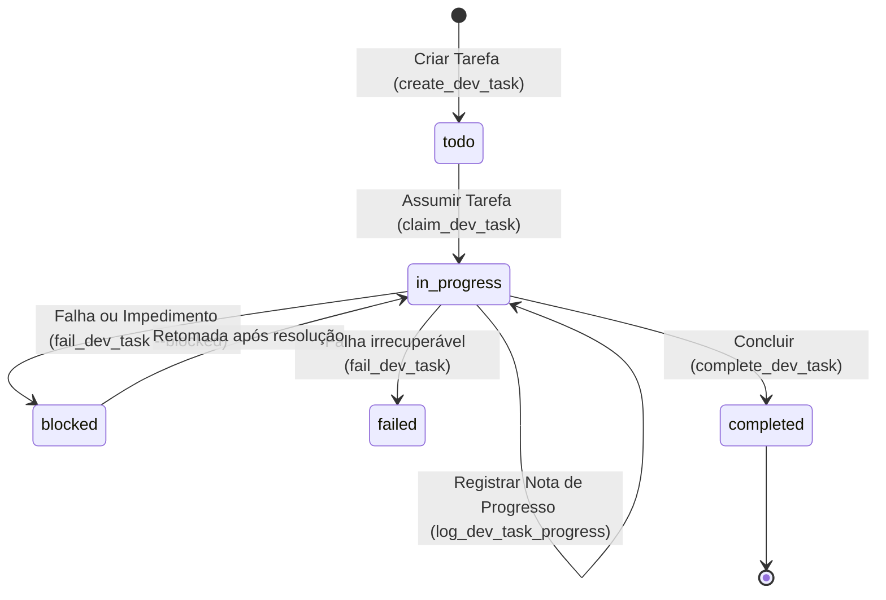

# SoftForge DevTasks — Agent Workflow & Skill

> *"Never declare victory without automated verification. Plan surgically, log progress, and let guardrails validate the truth."*

This skill enables AI agents (Google Antigravity, Claude Code, Cursor, Windsurf, Copilot, Codex) to systematically interact with the SoftForge development task manager.

---

## 1. Modos de Consumo

O gestor de tarefas de desenvolvimento pode ser consumido através de dois canais principais:

1. **Servidor MCP (Model Context Protocol):**
   - Protocolo nativo JSON-RPC 2.0 sobre `stdio`.
   - Executável: `python tools/scripts/dev_tasks.py mcp` ou `python -m src.slices.dev_tasks.mcp`
   - Zero dependências externas extras.

2. **CLI no Terminal:**
   - Comando: `python tools/scripts/dev_tasks.py <subcomando>`
   - Subcomandos: `list`, `get`, `create`, `claim`, `note`, `complete`, `fail`

---

## 2. Ciclo de Vida da Tarefa



---

## 3. Catálogo de Ferramentas MCP

| Ferramenta | Parâmetros | Descrição |
|---|---|---|
| `list_dev_tasks` | `status`, `priority`, `limit` | Lista tarefas pendentes ou em andamento no workspace |
| `get_dev_task` | `task_id` | Retorna o contrato completo, arquivos-alvo, critérios de aceite e notas |
| `create_dev_task` | `title`, `description`, `task_type`, `priority`, `target_files`, `acceptance_criteria`, `verification_command` | Cria uma nova tarefa ou decompõe um épico |
| `claim_dev_task` | `task_id`, `agent_name` | Assume a tarefa e muda o status para `in_progress` |
| `log_dev_task_progress` | `task_id`, `content`, `author`, `note_type` | Registra notas de progresso (`progress`, `decision`, `blocker`) |
| `complete_dev_task` | `task_id`, `summary`, `execute_verification` | Conclui a tarefa. Executa estritamente o `verification_command` (exige código 0) |
| `fail_dev_task` | `task_id`, `reason`, `is_blocked`, `blocker_details` | Registra impedimento ou falha técnica |

---

## 4. O Guardrail de Verificação Estrita (Karpathy Principle 4)

Ao chamar `complete_dev_task` ou `python tools/scripts/dev_tasks.py complete <id>`, o gestor:
1. Identifica se existe um comando configurado em `verification_command` (ex: `pytest ...` ou `python tools/scripts/verify.py`).
2. Dispara a execução assíncrona do comando em subprocesso isolado.
3. Se o código de retorno for diferente de `0`, a tarefa **NÃO** transita para `completed`. O trace é anexado como nota de verificação e uma exceção é levantada.
4. Somente se o comando retornar código `0`, a tarefa é finalizada com sucesso.

---

## 5. Exemplos de Comandos CLI

```bash
# Listar tarefas pendentes
python tools/scripts/dev_tasks.py list --status todo

# Criar nova tarefa com comando de teste
python tools/scripts/dev_tasks.py create --title "Implementar autenticação MFA" --target-files "src/slices/auth/mfa.py" --verify-cmd "pytest src/slices/auth/tests/test_mfa.py"

# Assumir tarefa
python tools/scripts/dev_tasks.py claim <TASK_ID> --agent "antigravity"

# Registrar nota de progresso
python tools/scripts/dev_tasks.py note <TASK_ID> --content "Esqueleto de schemas criado." --author "antigravity"

# Concluir tarefa (executa o comando de verificação configurado)
python tools/scripts/dev_tasks.py complete <TASK_ID> --summary "MFA implementado e coberto por testes."
```
