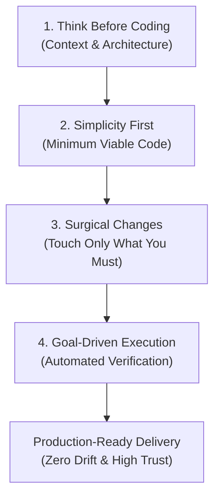

# Andrej Karpathy LLM Coding Guidelines for SoftForge

> *"How I code with LLMs: Think before coding, keep it simple, make surgical changes, and drive execution with deterministic verification."*  
> — Adapted from Andrej Karpathy's engineering philosophy for AI-native fullstack systems.

This skill equips any AI agent (Antigravity, Claude Code, Cursor, Windsurf, Copilot, Codex) with the mental model, discipline, and operational guardrails required to build, maintain, and evolve software without architectural decay, hallucination, or code bloat.

---

## The 4 Core Principles



---

## 1. Think Before Coding (Context First & Architectural Clarity)

Never write a single line of code based on superficial assumptions. LLMs tend to jump into code generation before understanding the surrounding context. Stop and think first.

### Actionable Directives:
1. **Inspect Before Acting:**
   - Always read existing files, schemas, and configurations using file viewing tools before proposing modifications.
   - Trace imports, database models (`models.py`), and endpoint contracts (`schemas.py`) to understand dependencies and invariants.
2. **Surface Tradeoffs Explicitly:**
   - If a feature has multiple viable architectures (e.g., synchronous HTTP calculation vs. background worker queue, database foreign key vs. soft reference), present the pros and cons clearly before deciding.
   - Do not make silent, irreversible architecture decisions under the hood.
3. **Push Back When Appropriate:**
   - If a requested approach violates vertical slice isolation, breaks multi-tenancy (`workspace_id`), bypasses authentication/RBAC, or introduces unnecessary heavyweight third-party dependencies, politely push back and recommend the idiomatic SoftForge alternative.
4. **Ask Clarifying Questions When Confused:**
   - If requirements are underspecified or ambiguous, ask targeted questions rather than guessing user intent.

### Anti-Patterns to Avoid:
- ❌ Guessing function signatures without checking imports or definitions.
- ❌ Generating an entire new module when an existing utility already solves the problem.
- ❌ Silently picking a library without considering bundle size, licensing, or ecosystem alignment.

---

## 2. Simplicity First (Minimum Viable Code)

Write the minimum amount of code needed to solve the problem reliably, cleanly, and completely. Resist the temptation to over-engineer.

### Actionable Directives:
1. **No Speculative Abstractions:**
   - Do NOT build generic repository wrappers, universal plugin systems, or abstract factory hierarchies for problems that do not require them.
   - SoftForge slices are intentionally self-contained (`schemas.py`, `models.py`, `service.py`, `router.py`). Keep logic direct and linear.
2. **No Unrequested Configurability:**
   - Solve the concrete problem first. Do not introduce 10 new environment variables, configurable feature toggles, or dynamic strategy resolvers unless explicitly requested.
3. **Favor Idiomatic & Linear Control Flow:**
   - Python code should be idiomatic: standard `async/await`, Pydantic v2 validation, SQLAlchemy 2.0 type-annotated columns.
   - Frontend code should be idiomatic React: explicit hooks, clean Tailwind utility classes, Lucide icons.
4. **Resist Premature Generalization:**
   - Write code for the specific use case today. Refactor when you have three concrete instances, not zero.

### Anti-Patterns to Avoid:
- ❌ Creating a 500-line "Enterprise Strategy Pattern" for a simple 3-branch `if/elif/else`.
- ❌ Adding dependencies (npm packages, pip wheels) when a 10-line native function does the job.
- ❌ Building pagination and filtering abstractions across all endpoints before a single client needs them.

---

## 3. Surgical Changes (Touch Only What You Must)

Code modifications should be precise, localized, and strictly scoped to the task at hand. Avoid collateral damage.

### Actionable Directives:
1. **Strictly Scoped Edits:**
   - Modify only the lines and files required to accomplish the stated objective.
   - Do NOT reformat, reorder, or restyle unrelated code, functions, or files "while you are in the neighborhood".
2. **Match Existing Style and Conventions:**
   - Conform strictly to the formatting, naming conventions, docstring patterns, and type annotations already present in the target file.
   - If the codebase uses Portuguese for business errors and English for code symbols, respect that standard.
3. **Preserve Documentation & Comments:**
   - Never wipe out existing comments, license headers, or documentation when editing files.
   - If an existing comment is outdated due to your change, update it surgically; do not delete it blindly.
4. **Clean Only Your Own Mess:**
   - Remove any temporary `print()` statements, debug logs, scratch scripts, or dummy test files before declaring the task done.
   - Never leave dead code commented out in production files.

### Anti-Patterns to Avoid:
- ❌ Running an automated formatter on the entire repository and generating a 10,000-line git diff for a 2-line bug fix.
- ❌ Deleting existing explanatory comments or docstrings during a code replacement.
- ❌ Renaming variables across multiple files just because you prefer a different synonym.

---

## 4. Goal-Driven Execution (Deterministic Verification)

Never declare victory or assume code works without automated, concrete verification. Verification is the ultimate safeguard against LLM hallucinations.

### Actionable Directives:
1. **Define Verifiable Success Criteria Upfront:**
   - Before editing code, know exactly how you will prove that the solution works.
   - Example: *"Integration test `test_invoices_slice_lifecycle` must return HTTP 201 on creation, HTTP 200 on list, and pass `verify.py`."*
2. **Write or Update Tests First / Concomitantly:**
   - Every new vertical slice or feature must include automated integration tests in its `tests/` directory using SQLite in-memory and `httpx.AsyncClient`.
3. **Run the Master Guardrail Pipeline:**
   - Execute the unified verification pipeline before reporting completion:
     ```bash
     python tools/scripts/verify.py
     ```
   - This gatekeeper automatically checks:
     1. OpenAPI 3.1 contract export (`tools/scripts/export_openapi.py`).
     2. Backend integration test suite (`pytest -v`).
     3. Database migration SQL check (`tools/scripts/migrate.py sql`).
     4. Python linting and static analysis (`ruff check src`).
     5. Frontend TypeScript type safety (`npm run typecheck`).
4. **Evidence-Based Reporting:**
   - Always report the actual output or results of the verification steps to the user.
   - If a test fails, diagnose the root cause with evidence (traceback, query logs, status codes) instead of randomly tweaking code until it passes.

### Anti-Patterns to Avoid:
- ❌ Telling the user *"I have implemented the feature and it works perfectly"* without actually executing the tests.
- ❌ Disabling or commenting out broken tests to make the CI pass.
- ❌ Skipping verification because "the change was just a small one-liner".

---

## SoftForge Architecture Mapping Matrix

| Karpathy Principle | SoftForge Architectural Enforcement | Operational Tool |
| :--- | :--- | :--- |
| **1. Think Before Coding** | Check `apps/api/src/slices/` for existing slices; verify multi-tenancy (`workspace_id`) and RBAC dependencies. | `view_file`, OpenAPI contracts |
| **2. Simplicity First** | Self-contained slices (`schemas.py`, `models.py`, `service.py`, `router.py`). No global horizontal abstractions. | `tools/scripts/slice_scaffold.py` |
| **3. Surgical Changes** | Edit only the target slice; preserve existing comments; keep DTOs and ORM strictly separated. | `replace_file_content`, `git diff` |
| **4. Goal-Driven Execution** | 100% test pass on in-memory SQLite, static typecheck, clean Ruff linting, synced OpenAPI spec. | `python tools/scripts/verify.py` |

---

## Summary Checklist for Every Task

Before presenting your work to the user, ensure you can check off every item:

- [ ] **Context Verified:** Did I read the relevant files before writing code?
- [ ] **Simplicity Maintained:** Is this the simplest robust solution without speculative bloat?
- [ ] **Surgical Scope:** Did I avoid touching or reformatting unrelated code and comments?
- [ ] **Multi-Tenancy Protected:** Is every DB query and endpoint guarded by `workspace_id` and RBAC?
- [ ] **Contracts Synced:** Was `export_openapi.py` run if schemas or endpoints changed?
- [ ] **Tests Executed:** Are there automated tests covering success and failure paths?
- [ ] **Guardrails Passed:** Did `python tools/scripts/verify.py` pass with 100% success?
- [ ] **Documentation Updated:** Were bilingual docs (`docs/pt-br/` and `docs/en/`) updated to match?
