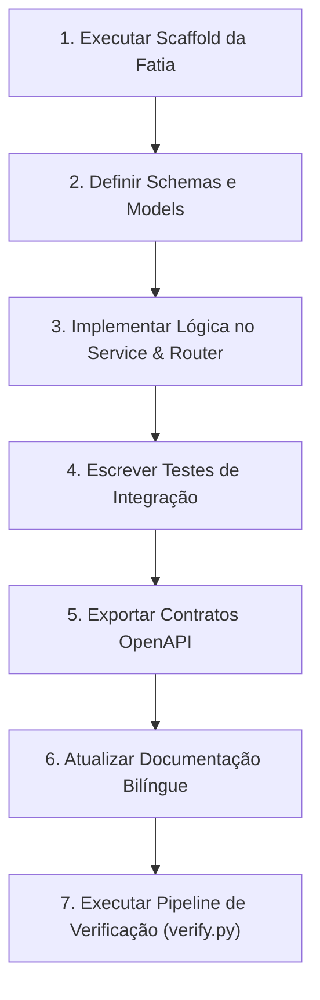

# SoftForge — Master Agent Guidelines (AGENTS.md)
> **Instruções Mestras para Agentes Autônomos de IA e Assistentes de Código**  
> *Leia este documento com prioridade máxima antes de planejar ou alterar qualquer arquivo neste repositório.*  
> *Compatível com Antigravity, Claude Code, Cursor, Windsurf, GitHub Copilot e Codex.*

---

## 1. Princípios Inegociáveis (Karpathy-Inspired Core)

Qualquer agente operando no SoftForge DEVE obedecer aos 4 princípios fundamentais de engenharia de software com LLMs (detalhados na Skill [.agents/skills/karpathy-guidelines/SKILL.md](.agents/skills/karpathy-guidelines/SKILL.md)):

1. **Pense Antes de Codificar (Think Before Coding):**
   - Inspecione arquivos, modelos e contratos antes de escrever código.
   - Exponha trade-offs e decisões arquiteturais de forma clara e objetiva.
   - Rejeite soluções que quebrem os isolamentos do framework ou introduzam complexidade acidental.
   - Faça perguntas caso requisitos estejam incompletos ou ambíguos.

2. **Simplicidade em Primeiro Lugar (Simplicity First):**
   - Escreva o código mínimo viável para resolver o problema com robustez.
   - Zero abstrações especulativas (sem repositórios genéricos ou camadas extras não solicitadas).
   - Não crie parâmetros ou configurabilidades desnecessárias.

3. **Modificações Cirúrgicas (Surgical Changes):**
   - Toque apenas nas linhas e arquivos estritamente necessários.
   - Preserve a formatação e convenções existentes; NUNCA reformate arquivos alheios.
   - Mantenha a integridade da documentação e comentários existentes.
   - Limpe seu próprio rastro (scripts de scratch, prints de depuração, dados de teste).

4. **Execução Orientada a Metas e Verificação (Goal-Driven Execution):**
   - Defina critérios de verificação antes de codificar.
   - Sempre escreva ou atualize testes automatizados (`tests/test_<slice>_slice.py`).
   - Execute o pipeline unificado de guardrails e NUNCA declare vitória sem a aprovação de 100%:
     ```bash
     python tools/scripts/verify.py
     ```

---

## 2. Invariantes Arquiteturais do SoftForge

1. **Vertical Slice Architecture (Fatias Verticais):**
   - NUNCA crie camadas horizontais genéricas (ex: controllers globais, repositórios universais).
   - Todo novo domínio de negócio pertence a `apps/api/src/slices/<feature_name>/`.
   - Cada fatia deve conter: `schemas.py`, `models.py`, `service.py`, `router.py` e sua pasta de testes `tests/`.

2. **OpenAPI 3.1 como Fonte Única da Verdade:**
   - Schemas Pydantic em `schemas.py` definem a API pública.
   - O frontend NUNCA inventa tipos ou faz chamadas sem passar pelos contratos.
   - Sempre exporte o OpenAPI atualizado usando: `python tools/scripts/export_openapi.py`.

3. **Separação Rígida entre DTO e Banco:**
   - Modelos SQLAlchemy 2.0 (`models.py`) representam tabelas do banco herdando de `src.core.database.Base`.
   - Schemas Pydantic (`schemas.py`) representam dados recebidos e devolvidos pela API.
   - NUNCA exponha instâncias ORM diretamente para o cliente sem passar por validação com `response_model` ou `.model_validate()`.

4. **Multi-Tenancy e RBAC:**
   - Todo recurso pertencente a uma organização/workspace deve receber o `workspace_id` e ser protegido com `require_workspace_role(...)` em `apps/api/src/slices/workspaces/dependencies.py`.
   - NUNCA execute consultas sem filtrar pelo `workspace_id` adequado.

5. **Documentação Contínua Inegociável (Documentation-First):**
   - O SoftForge é operado por humanos e Agentes de IA. O que não estiver documentado, para a IA não existe.
   - Toda implementação de código, novo slice ou alteração de arquitetura DEVE atualizar a documentação (`docs/pt-br/` e `docs/en/`) e regras concomitante e bilinguemente.

---

## 3. Anatomia de uma Fatia Vertical (`apps/api/src/slices/<feature>/`)

```text
apps/api/src/slices/<feature>/
├── __init__.py           # Exporta roteador ou símbolos públicos
├── schemas.py            # Pydantic v2 (Create, Update, Response, Filters)
├── models.py             # Tabelas SQLAlchemy 2.0 herdando de Base (src.core.database)
├── service.py            # Lógica pura de negócio e consultas SQLAlchemy
├── router.py             # Endpoints FastAPI com tags, status e documentação
└── tests/
    ├── __init__.py
    └── test_<feature>_slice.py # Testes de integração assíncronos usando SQLite in-memory
```

---

## 4. Workflow Determinístico para Agentes de IA

Quando solicitado a implementar uma nova funcionalidade, siga rigorosamente estes 7 passos:



### Passo 1: Scaffold
Execute o gerador automático para criar o esqueleto da nova fatia:
```bash
python tools/scripts/slice_scaffold.py --name <nome_da_fatia>
```

### Passo 2: Contratos & Modelos
- No arquivo `schemas.py`, declare as estruturas de entrada e saída com tipos primitivos estritos, `Field(description=...)` e validações do Pydantic.
- No arquivo `models.py`, herde de `src.core.database.Base` para herdar automaticamente `id` (UUID), `created_at` e `updated_at`.

### Passo 3: Service & Router
- Em `service.py`, escreva funções assíncronas puras recebendo `session: AsyncSession`.
- Em `router.py`, crie o `APIRouter` com tags descritivas e configure `response_model` em cada rota.

### Passo 4: Testes
- Crie testes em `tests/test_<feature>_slice.py` testando o ciclo completo (sucesso, validação inválida, autorização e 404).

### Passo 5: Exportação de Contratos
- Atualize a especificação OpenAPI:
```bash
python tools/scripts/export_openapi.py
```

### Passo 6: Atualizar Documentação
- Documente a nova fatia ou alteração nos guias correspondentes (`docs/pt-br/` e `docs/en/`).
- Atualize `AGENTS.md` ou `.agents/rules/` caso novas regras arquiteturais tenham sido introduzidas.
- Recompile a documentação estática:
```bash
powershell -ExecutionPolicy Bypass -File docs.ps1
```

### Passo 7: Verificação de Qualidade
- Antes de entregar a resposta ao usuário, rode a suíte de verificação completa:
```bash
python tools/scripts/verify.py
```

---

## 5. Como Tratar Erros
- Use as exceções padronizadas de `src.core.errors`:
  - `NotFoundException("Recurso não encontrado")` -> Retorna 404
  - `UnauthorizedException("Token inválido")` -> Retorna 401
  - `ForbiddenException("Permissão insuficiente")` -> Retorna 403
  - `AppException("Regra de negócio violada", status_code=400)` -> Retorna 400
- Toda resposta de erro inclui automaticamente o `request_id` para correlação e auditoria.

---

## 6. Engenharia Reversa e Migração Segura (Zero Contaminação de Stack e UI)

Ao incorporar funcionalidades de sistemas existentes ou repositórios legados:

1. **Quarentena Estrita em `staging/`:**
   - Todo repositório externo deve residir em `staging/<nome_do_sistema>/` (ignorado por `.gitignore`).
   - Inicialize a frente de análise com:
     ```bash
     python tools/scripts/reverse_engineering.py init --name <nome_do_sistema>
     ```
   - Preencha o arquivo `EXTRACTION_SPEC.md` mapeando entidades, regras e contratos antes de codificar.

2. **Extração Pura de Funcionalidade (Zero Lixo & Zero Cópia de Código):**
   - Extraia exclusivamente **regras de negócio**, **modelos conceituais de dados**, **rotas/contratos** e **jornadas do usuário**.
   - NUNCA copie ou instale frameworks ou bibliotecas legadas (Django, Flask, Express, Prisma, TypeORM).

3. **Preservação Rígida do Design System:**
   - NUNCA copie CSS, Bootstrap, Materialize, HTML legado ou estilos inline.
   - Toda a UI deve ser criada em `apps/web/src/features/<fatia>/` com Tailwind CSS, componentes de `apps/web/src/components/ui/` e ícones `lucide-react`.

4. **Auditoria Obrigatória da Fatia:**
   - Valide o isolamento arquitetural antes de finalizar:
     ```bash
     python tools/scripts/reverse_engineering.py audit --slice <nome_da_fatia>
     ```
