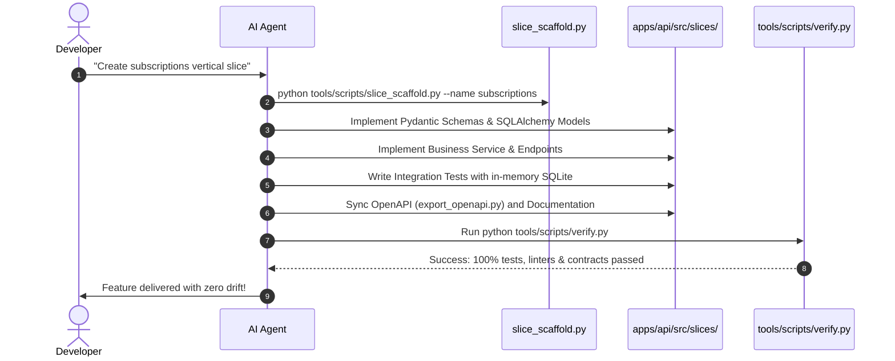
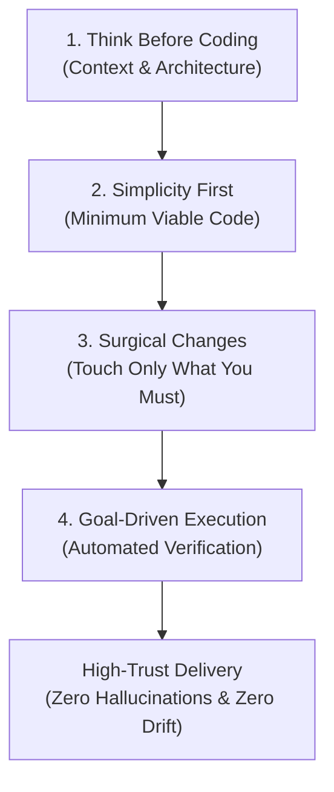

# AI-Assisted Development Workflow

> **How Autonomous Agents and Engineers Build with SoftForge**  
> *Cursor, Antigravity, Claude Code, GitHub Copilot, and LLMs.*

---

## 1. The Role of `AGENTS.md` and `.ai/AGENTS.md`

When opening this codebase in agentic tools like Cursor, Claude Code, or Google Antigravity, [AGENTS.md](../../AGENTS.md) acts as the **System Constitution**:
- It dictates architectural rules that the AI must never violate.
- It details slice boundaries and naming conventions.
- It establishes the deterministic quality gates before closing tasks.
- It anchors the model to the Canonical Skill [.agents/skills/karpathy-guidelines/SKILL.md](../../.agents/skills/karpathy-guidelines/SKILL.md).

---

## 2. The Deterministic 7-Step Loop



---

## 3. Andrej Karpathy LLM Coding Guidelines for SoftForge

SoftForge natively integrates the LLM-assisted programming philosophy pioneered by **Andrej Karpathy** (researcher, former Tesla Director of AI, and OpenAI co-founder).

The canonical skill resides in `.agents/skills/karpathy-guidelines/SKILL.md` and enforces 4 pillars:



### 1. Think Before Coding (Context & Architecture)
- **Context Inspection:** Before writing code, the AI inspects schema files, existing endpoints, and database models.
- **Explicit Trade-offs:** For ambiguous designs (e.g., relational DB vs Redis, sync vs background queue), the AI surfaces pros and cons before coding.
- **Architectural Defense:** The model pushes back against designs that violate slice isolation or break multi-tenancy (`workspace_id`).
- **Clarification:** When specifications are ambiguous or incomplete, the AI asks targeted questions rather than guessing user intent.

### 2. Simplicity First (Minimum Viable Code)
- **Minimal Footprint:** Writes the cleanest, most direct code that completely solves the problem.
- **No Speculative Abstractions:** Generic repositories, factory layers, and unrequested configurability are prohibited.
- **Linearity:** Prefers linear, idiomatic Python and React over complex design patterns.

### 3. Surgical Changes (Touch Only What You Must)
- **Tight Scope:** Only files and lines essential to the task are edited.
- **Legacy Respect:** Never reformats untouched code, reshuffles imports, or overwrites existing styles.
- **Documentation Preservation:** All docstrings, inline comments, and guides are preserved and updated surgically.
- **Clean Tracks:** Removes debug logs, scratch scripts, and temporary files before presenting the final result.

### 4. Goal-Driven Execution (Deterministic Verification)
- **Objective Criteria:** Establishes verification metrics before touching code.
- **Automated Tests:** Comprehensive integration tests in `tests/test_<feature>_slice.py` using in-memory SQLite.
- **Unified Quality Gate:** Runs `python tools/scripts/verify.py` and only reports success when 100% of checks pass.

---

## 4. Multi-AI Compatibility Matrix

SoftForge provides universal discovery bridges for every major AI coding tool:

| Assistant / Tool | Discovery Entry Point | Role |
| :--- | :--- | :--- |
| **Google Antigravity** | `.agents/skills/karpathy-guidelines/SKILL.md` | Canonical progressive on-demand skill |
| **Google Antigravity & Rules** | `.agents/rules/karpathy-guidelines.md` | Active contextual editing rules |
| **Claude Code** | `CLAUDE.md` | Root workspace instructions & shortcuts |
| **Cursor & Windsurf** | `AGENTS.md` and `.ai/rules/` | Master instructions and hierarchical rules |
| **GitHub Copilot** | `.github/copilot-instructions.md` | Workspace chat & inline context prompts |
| **Universal LLMs** | `AGENTS.md` | Root-level system constitution |

---

## 5. Scaffolder & AI Project Initialization

When scaffolding a new project or adding vertical slices, the AI environment is automatically provisioned:

### Universal AI Sync:
```bash
# Initializes or refreshes all AI skills and rules in any target folder
python tools/scripts/init_project_ai.py
```

### Scaffolding Slices with AI Guidance:
```bash
# Creates the complete slice skeleton with Karpathy engineering reminders
python tools/scripts/slice_scaffold.py --name invoices

# Or bootstrap AI skills directly from the scaffolder:
python tools/scripts/slice_scaffold.py --init-ai
```

---

## 6. Recommended Prompts for Steering LLMs

### Example 1: Creating a new slice
```text
Strictly follow guidelines in AGENTS.md and Karpathy principles.
Scaffold a new vertical slice named 'invoices' using tools/scripts/slice_scaffold.py.
Implement amount, customer_id, due_date, and status (pending, paid, cancelled).
Include tests covering success and validation errors, then run verify.py to certify.
```

### Example 2: Updating an existing feature
```text
Navigate to apps/api/src/slices/projects/.
Add a 'priority' field ('low', 'medium', 'high') to tasks schema and model.
Update corresponding integration tests and ensure export_openapi.py and verify.py pass.
```
