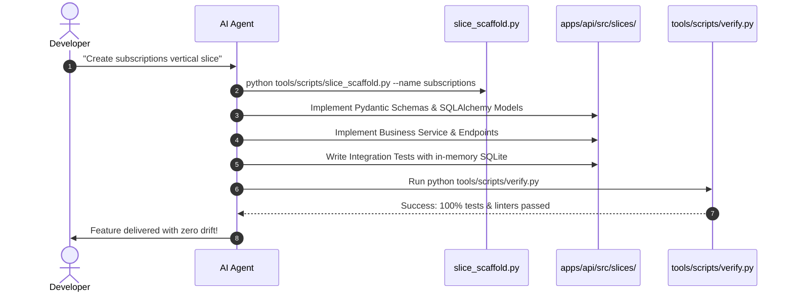

# AI-Assisted Development Workflow

> **How Autonomous Agents and Engineers Build with SoftForge**  
> *Cursor, Antigravity, Claude Code, GitHub Copilot, and LLMs.*

---

## 1. The Role of `.ai/AGENTS.md`

When opening this codebase in agentic tools like Cursor, Claude Code, or Google Antigravity, [.ai/AGENTS.md](../../.ai/AGENTS.md) acts as the **System Constitution**:
- It dictates architectural rules that the AI must never violate.
- It details slice boundaries and naming conventions.
- It establishes the deterministic quality gates before closing tasks.

---

## 2. The Deterministic 6-Step Loop



---

## 3. Recommended Prompts for Steering LLMs

### Example 1: Creating a new slice
```text
Strictly follow guidelines in .ai/AGENTS.md.
Scaffold a new vertical slice named 'invoices' using tools/scripts/slice_scaffold.py.
Implement amount, customer_id, due_date, and status (pending, paid, cancelled).
Include tests covering success and validation errors, then run verify.py to certify.
```

### Example 2: Updating an existing feature
```text
Navigate to apps/api/src/slices/projects/.
Add a 'priority' field ('low', 'medium', 'high') to tasks schema and model.
Update corresponding integration tests and ensure export_openapi.py and verify.py pass.
```
