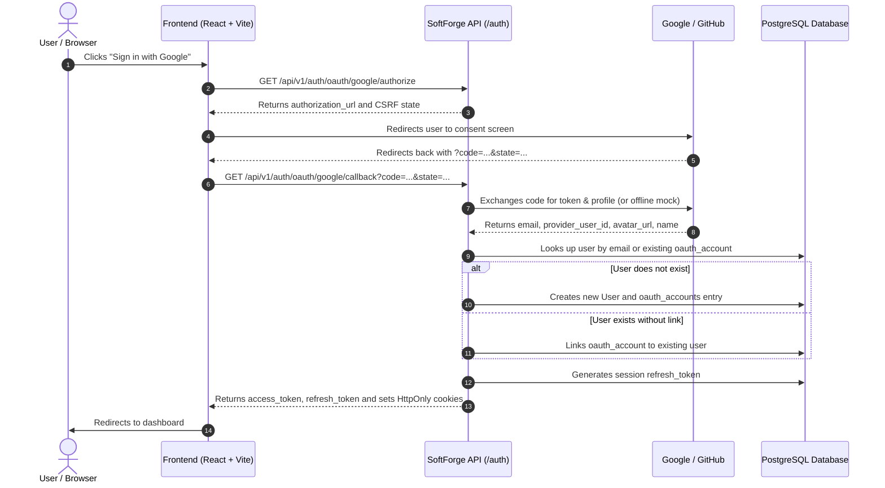

# Social Authentication & OAuth2 (Google & GitHub)

> **One-click secure login, automatic email-based account linking, and 100% offline development support.**

---

## 1. Architecture Overview

SoftForge features an **OAuth2 Authorization Code Flow** built for security, privacy, and full developer autonomy:

- **Built-in Providers:** Ready-to-use adapters for **Google** and **GitHub**.
- **Smart Account Linking (Auto-Linking):** If an existing user registered via password, logging in via OAuth with the same verified email automatically links the OAuth provider to their existing profile without losing data.
- **Dedicated `oauth_accounts` Table:** One user can link multiple OAuth providers simultaneously with a unique constraint on `(provider, provider_user_id)`.
- **Nullable Password:** OAuth-created users have `hashed_password = null` and can optionally set a password later.
- **Dual Session Mechanism:** Sets `HttpOnly` security cookies and returns standard Bearer JWT tokens in the JSON response payload.
- **Seamless Offline Mock:** During local development or offline test runs, codes prefixed with `mock-` or missing client secrets automatically return synthetic profiles without network timeouts.

---

## 2. OAuth2 Flow Diagram



---

## 3. Endpoints

### `GET /api/v1/auth/oauth/{provider}/authorize`
Generates authorization URL with CSRF protection.

- **Path Parameters:** `provider` (`google` or `github`).
- **Query Params:** `redirect_uri` (optional).

### `GET /api/v1/auth/oauth/{provider}/callback`
Validates code, retrieves user profile, creates or links account, and returns session tokens.

- **Path Parameters:** `provider` (`google` or `github`).
- **Query Params:** `code`, `state`.

---

## 4. Environment Variables

In `apps/api/.env`:

```env
FRONTEND_URL=http://localhost:5173
GOOGLE_CLIENT_ID=your_google_client_id
GOOGLE_CLIENT_SECRET=your_google_client_secret
GITHUB_CLIENT_ID=your_github_client_id
GITHUB_CLIENT_SECRET=your_github_client_secret
```
