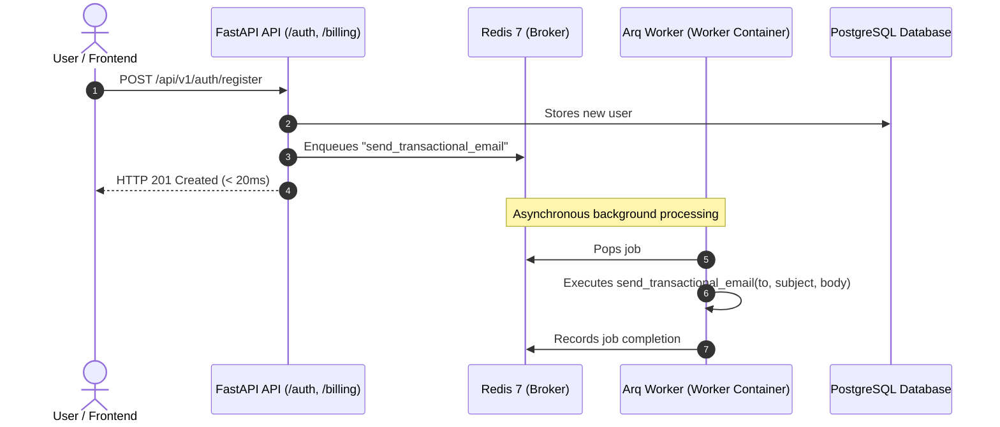

# Asynchronous Queue & Background Workers (Arq + Redis)

> **Asyncio-native background task processing, periodic cron scheduling, and 100% offline test execution.**

---

## 1. Architectural Overview

SoftForge adopts **Arq** as the official async queue and background worker engine:

- **100% Asyncio Native:** Designed specifically for Python's `async/await` event loop. Seamlessly calls SQLAlchemy 2.0 Async and asynchronous HTTP clients (`httpx`) without blocking worker threads.
- **Lightweight & High Performance:** Relies on Redis 7, eliminating the heavy memory footprint and broker complexity of legacy Celery setups.
- **Container Isolation:** In production and Docker Compose environments, the `worker` runs in a dedicated service isolated from the FastAPI web server.
- **100% Offline Testing:** Includes an in-memory `FakeQueueClient`. During `pytest` runs, jobs are tracked in memory without requiring a live Redis server or network connectivity.
- **Built-in Cron Scheduling:** Declarative periodic tasks (e.g., daily cleanup of revoked tokens at 03:00 UTC).

---

## 2. Queue Flow Diagram



---

## 3. Built-in Background Tasks

Tasks are defined in `apps/api/src/core/queue/tasks.py`:

| Task | Trigger | Description |
| :--- | :--- | :--- |
| `send_transactional_email` | Event (e.g. registration, invoice) | Asynchronously dispatches welcome emails, password resets, or payment receipts. |
| `process_subscription_renewal` | Webhook / Invoice | Handles renewal calculations and quota upgrades for subscriptions. |
| `cleanup_revoked_tokens` | Daily Cron (03:00 UTC) | Deletes expired or revoked JWT session tokens from the database. |

---

## 4. How to Enqueue Jobs in Application Code

Use the `get_queue` dependency anywhere in your FastAPI routes or service layer:

```python
from fastapi import APIRouter
from src.core.queue import get_queue

router = APIRouter()

@router.post("/invite")
async def invite_member(email: str):
    queue = await get_queue()
    job_id = await queue.enqueue(
        "send_transactional_email",
        to_email=email,
        subject="You have been invited to a Workspace!",
        body_html="<p>Click the link to accept.</p>",
    )
    return {"status": "enqueued", "job_id": job_id}
```

---

## 5. Development & Production Execution

### Docker Compose
```bash
docker compose up -d
```

### Local Worker Execution
```bash
cd apps/api
.\.venv\Scripts\activate
arq src.core.queue.worker.WorkerSettings
```
