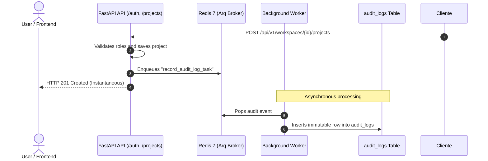

# Vertical Slice: Audit Logs & Compliance

> **Immutable audit trail, zero-latency async dispatching via Arq Worker, and LGPD/GDPR compliance.**

---

## 1. Architectural Overview

The `audit` slice (`apps/api/src/slices/audit/`) delivers security and compliance observability across workspaces:

- **Zero-Latency Async Dispatch:** High-throughput endpoints enqueue events to Redis (`record_audit_log_task`). The database insertion is handled asynchronously by the background worker, ensuring API responses remain instantaneous (< 15ms).
- **Immutable Trail (Append-Only):** The `audit_logs` table has no `updated_at` column, ensuring log tamper-resistance for audits and security reviews.
- **Network Observability:** Automatic extraction of client IP address (supporting reverse proxy headers such as `X-Forwarded-For`) and browser `User-Agent`.
- **Historical Identity Preservation:** Stores the author's email snapshot (`user_email`), guaranteeing audit integrity even if user accounts are subsequently deleted.
- **RBAC Protection:** Audit queries require at least Administrator level (`WorkspaceRole.ADMIN`).

---

## 2. Audit Trail Flow Diagram

---

## 3. Endpoints

### `GET /api/v1/workspaces/{workspace_id}/audit-logs`
Paginated query for workspace audit events.

- **Required Role:** `owner` or `admin`.
- **Query Params:** `action`, `resource_type`, `user_id`, `page`, `page_size`.
