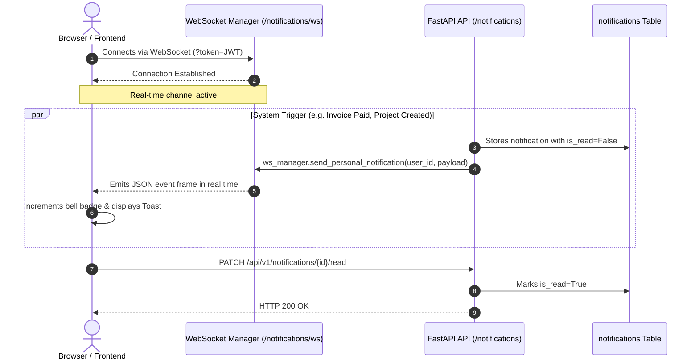

# Vertical Slice: In-App Notifications & WebSockets

> **Real-time full-duplex WebSocket notification stream, dynamic unread counters, and persistent history.**

---

## 1. Architectural Overview

The `notifications` slice (`apps/api/src/slices/notifications/`) manages real-time alerts and user messaging:

- **Full-Duplex WebSocket Channel:** Authenticated WebSocket endpoint at `/api/v1/notifications/ws?token=...` delivering events instantly without polling overhead.
- **Multi-Device Connection Manager:** `NotificationConnectionManager` tracks open sockets per `user_id`, multiplexing frames to all active tabs or devices simultaneously.
- **Liveness Ping/Pong:** Responds to client `{"type": "ping"}` heartbeats with `{"type": "pong"}` to maintain long-lived connection health.
- **Persistent History:** Every notification is stored in PostgreSQL (`notifications` table) with read status and unread counters.
- **Batch Operations:** Supports single read updates (`PATCH /{id}/read`) and mass mark-as-read (`POST /mark-all-read`).

---

## 2. Notification Flow Diagram

---

## 3. Endpoints

### `GET /api/v1/notifications`
Paginated notifications for the authenticated user.

- **Query Params:** `unread_only`, `page`, `page_size`.

### `GET /api/v1/notifications/unread-count`
Returns the badge counter (`unread_count`).

### `PATCH /api/v1/notifications/{notification_id}/read`
Marks a specific notification as read.

### `POST /api/v1/notifications/mark-all-read`
Marks all user notifications as read in a single batch.

### `WebSocket /api/v1/notifications/ws`
Persistent full-duplex stream authenticated via `?token=<access_token>`.
