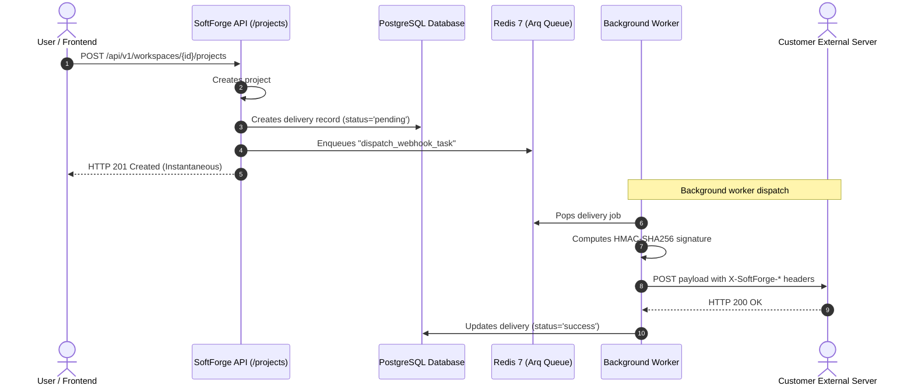

# Vertical Slice: Outbound Webhooks

> **Decoupled event dispatching via Arq Worker, HMAC-SHA256 signature verification, and delivery logging.**

---

## 1. Architectural Overview

The `webhooks` slice (`apps/api/src/slices/webhooks/`) enables third-party integration capabilities for workspaces in SoftForge:

- **Decoupled Asynchronous Dispatch:** When an event occurs (e.g., project created, member invited, invoice paid), the API logs a `pending` delivery row and delegates HTTP transmission to the Arq Worker, keeping web API latency minimal (< 15ms).
- **HMAC-SHA256 Signatures:** Every endpoint generates a secret key (`whsec_...`). Outbound requests include `X-SoftForge-Signature: t={timestamp},v1={hex_digest}` preventing payload tampering and replay attacks.
- **Granular Event Filtering:** Webhook endpoints can subscribe to specific events (e.g. `["project.created"]`) or use wildcard `["*"]` for all events.
- **Comprehensive Delivery Logs:** The `webhook_deliveries` table tracks HTTP status codes, initial response body characters, timestamps, retry counts, and error traces.
- **Offline & Mock Testing:** Endpoints configured with `mock://` urls are processed locally by the worker in milliseconds without external HTTP requests.

---

## 2. Sequence Diagram

---

## 3. Endpoints

Requires Administrator or Owner permissions (`WorkspaceRole.ADMIN`):

| Method | Endpoint | Description |
| :--- | :--- | :--- |
| `POST` | `/api/v1/workspaces/{id}/webhooks` | Registers new endpoint and creates `whsec_` secret |
| `GET` | `/api/v1/workspaces/{id}/webhooks` | Lists all workspace webhooks |
| `GET` | `/api/v1/workspaces/{id}/webhooks/{endpoint_id}` | Retrieves webhook details |
| `PATCH` | `/api/v1/workspaces/{id}/webhooks/{endpoint_id}` | Updates URL, subscribed events, or active status |
| `DELETE` | `/api/v1/workspaces/{id}/webhooks/{endpoint_id}` | Deletes webhook and associated delivery logs |
| `GET` | `/api/v1/workspaces/{id}/webhooks/{endpoint_id}/deliveries` | Paginated delivery history |
