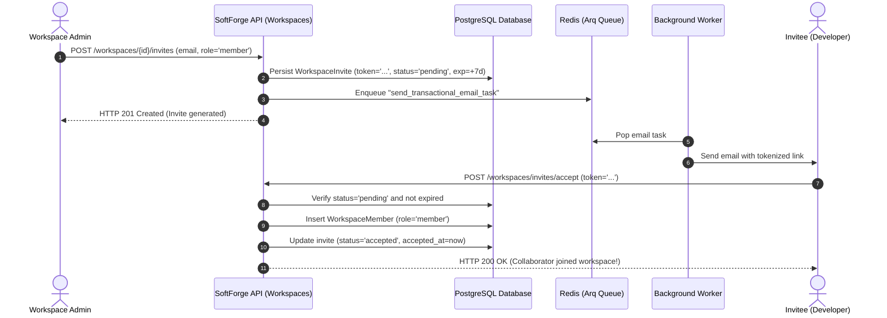

# Slice: Team Invites & Member Management (RBAC)

> **Multi-user collaboration with email invites, secure 7-day tokens, hierarchical role enforcement, and Owner deletion protections.**

---

## 1. Slice Overview

The team collaboration expansion in the `workspaces` slice (`apps/api/src/slices/workspaces/`) implements the full collaboration lifecycle for SoftForge:

- **Token-Secured Invites:** Workspace administrators invite collaborators by providing their corporate email and initial RBAC role (Admin, Member, Viewer). A high-entropy 32-byte token (`secrets.token_urlsafe(32)`) with a 7-day lifetime is automatically issued.
- **Asynchronous Email Dispatch via Arq Worker:** The invitation email containing the activation link (`/invites/accept?token=...`) is enqueued in Redis and dispatched by the background worker with zero API latency.
- **Seamless Invite Acceptance:** Authenticated users accept invitations via `/api/v1/workspaces/invites/accept` and are immediately added as active workspace members.
- **Strict RBAC Hierarchy:**
  - `Owner (4)`: Total authority, billing management, ownership transfer, and workspace deletion.
  - `Admin (3)`: Issues and revokes invites, manages member roles, and configures integrations (webhooks and API keys).
  - `Member (2)`: Read and write access to business domain resources (projects, tasks).
  - `Viewer (1)`: Read-only access across the workspace.
- **Workspace Integrity Protections:**
  - The `Owner` **can never be removed** from the workspace or demoted by another member.
  - Ownership transfer can only be authorized by the current `Owner`.
  - Attempts to invite an active workspace member are rejected with HTTP 400 Bad Request.
  - Pending invites for the same email are refreshed with a newly generated token and renewed 7-day expiration.
- **Audit Logs & Webhook Telemetry:** Actions such as invite creation, acceptance, role change, and member removal emit structured audit events (`invite.created`, `invite.accepted`, `member.role_updated`, `member.removed`) and outbound webhooks.

---

## 2. Invitation & Onboarding Flow

---

## 3. Slice Endpoints

| Method | Route | Description | Minimum Role |
| :--- | :--- | :--- | :--- |
| `POST` | `/api/v1/workspaces/{workspace_id}/invites` | Issues an invitation email with a 7-day token | `Admin` |
| `GET` | `/api/v1/workspaces/{workspace_id}/invites` | Lists all pending invitations for the workspace | `Admin` |
| `DELETE` | `/api/v1/workspaces/{workspace_id}/invites/{invite_id}` | Immediately revokes a pending invitation | `Admin` |
| `POST` | `/api/v1/workspaces/invites/accept` | Accepts an invitation using a cryptographic token | `Authenticated` |
| `GET` | `/api/v1/workspaces/{workspace_id}/members` | Lists all current members of the workspace | `Viewer` |
| `PATCH` | `/api/v1/workspaces/{workspace_id}/members/{user_id}` | Updates a member's RBAC role | `Admin` |
| `DELETE` | `/api/v1/workspaces/{workspace_id}/members/{user_id}` | Removes a member from the workspace | `Admin` |

---

## 4. Automated Verification & Testing

The deterministic test suite covers:
1. **Issuance and Token Generation:** Validates unique 32-byte token creation and 7-day expiration.
2. **Duplicate Prevention:** Immediate 400 Bad Request error if the email already belongs to an active member.
3. **Acceptance and Membership:** Immediate workspace access upon valid token submission.
4. **Revoked & Expired Guards:** Appropriate rejection (404/400) for obsolete or expired invites.
5. **RBAC Governance:** Guarantees that the `Owner` cannot be expelled or demoted.
