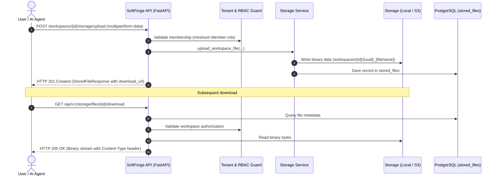

# Slice: Storage & File Management

> **Binary asset and document storage with hybrid support: local filesystem in offline dev/tests and S3/MinIO compatibility for production.**

---

## 1. Slice Overview

The `storage` slice (`apps/api/src/slices/storage/`) provides SoftForge's unified binary persistence engine:

- **Provider-Agnostic Storage Architecture:** Abstracts physical storage through a standardized interface, allowing developers to run entirely offline on local disk (`uploads/`) while seamlessly switching to AWS S3, Cloudflare R2, or MinIO in production.
- **100% Offline Development:** During local development and `pytest` execution, files are persisted and retrieved directly from the filesystem without any network dependencies or external cloud credentials.
- **Multi-Tenant Workspace Isolation:** Files attached to a workspace are enforced by RBAC. Members from foreign workspaces receive HTTP 403 Forbidden when attempting to access private files.
- **Public vs. Private Assets:** Native support for public files (such as user avatars at `/storage/files/{id}/download`), enabling frictionless browser rendering without Authorization headers.
- **Multipart Uploads & Quota Limits:** Endpoints are guarded with configurable file size limits (`MAX_UPLOAD_SIZE_MB`), rejecting oversized payloads with HTTP 413 Payload Too Large.
- **Filename Sanitization & Security:** Filenames are sanitized via regex to prevent path traversal attacks (`../`) and shell injection. File uploads and deletions trigger structured audit logs and outbound webhooks (`file.uploaded`, `file.deleted`).

---

## 2. Upload & Download Sequence



---

## 3. Slice Endpoints

| Method | Route | Description | Minimum Role |
| :--- | :--- | :--- | :--- |
| `POST` | `/api/v1/workspaces/{workspace_id}/storage/upload` | Uploads a file to the workspace | `Member` |
| `GET` | `/api/v1/workspaces/{workspace_id}/storage/files` | Lists files attached to the workspace | `Viewer` |
| `DELETE` | `/api/v1/workspaces/{workspace_id}/storage/files/{file_id}` | Deletes physical file and database record | `Member` |
| `GET` | `/api/v1/storage/files/{file_id}/download` | Downloads or streams the file | `Public / Authenticated` |
| `POST` | `/api/v1/users/me/avatar` | Updates the authenticated user's profile avatar | `Authenticated` |

---

## 4. Environment Configuration

```env
# Storage backend (local | s3 | minio)
STORAGE_BACKEND=local
STORAGE_LOCAL_DIR=uploads
MAX_UPLOAD_SIZE_MB=25

# S3 / MinIO credentials (for staging and production)
S3_BUCKET_NAME=softforge-uploads
S3_REGION=us-east-1
S3_ENDPOINT_URL=http://minio:9000
S3_ACCESS_KEY_ID=minioadmin
S3_SECRET_ACCESS_KEY=minioadmin
```

---

## 5. Automated Verification & Testing

The slice is verified with 100% deterministic Pytest coverage (`test_storage_slice.py`):
1. **Upload & Byte Parity:** Multipart transmission, database verification, and byte-for-byte fidelity checks.
2. **Streaming & Headers:** Correct `Content-Type` and `Content-Disposition` header verification.
3. **Tenant Isolation:** Immediate HTTP 403 Forbidden when accessing files across workspace boundaries.
4. **Public Avatars:** Updating user profile avatar with public access enabled without authentication headers.
