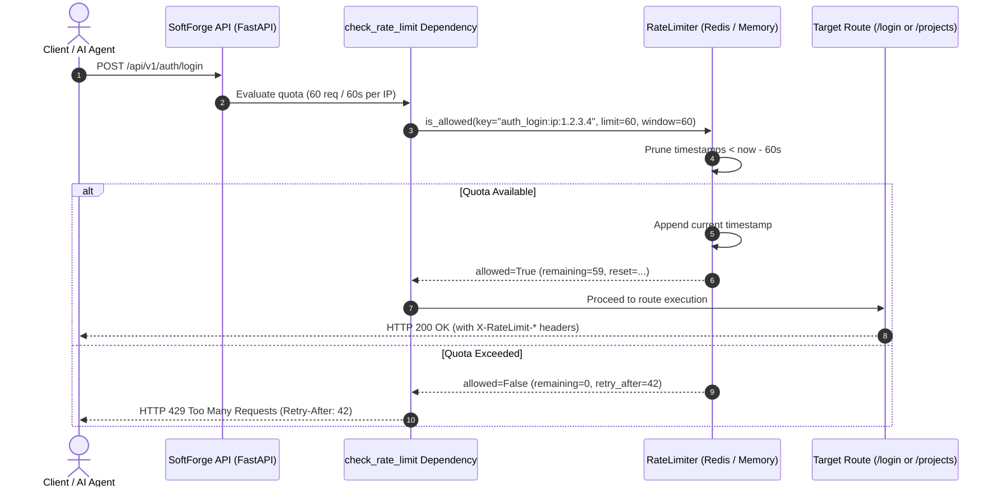

# Rate Limiting & Abuse Protection Engine

> **Brute force mitigation, infinite loop prevention for autonomous AI agents, and sliding window traffic shaping powered by Redis and in-memory fallback.**

---

## 1. Architectural Overview

The Rate Limiting module (`apps/api/src/core/ratelimit/`) provides SoftForge's perimeter shield and request throttling system:

- **Sliding Window Algorithm:** Unlike fixed-window counters that allow sudden bursts near boundary resets (*bursting exploits*), the sliding window algorithm evaluates the continuous rate of requests over rolling time windows with millisecond accuracy.
- **Hybrid Redis + In-Memory Engine (Zero Downtime / Zero External Dependencies):**
  - **Redis in Production:** Uses atomic Sorted Sets (`ZSET`) via pipelining, ensuring synchronized counter evaluation across distributed containers and API replicas.
  - **MemoryRateLimiter in Dev/Test:** Backed by high-speed `collections.deque` (< 0.2ms), enabling 100% offline execution of the `pytest` suite without external service requirements.
  - **Graceful Fallback:** If the Redis cluster becomes temporarily unavailable, the engine automatically falls back to in-memory tracking without dropping legitimate client traffic.
- **Granular Subject Targeting:**
  - `ip`: Real client IP (resolving reverse proxies and `X-Forwarded-For` headers).
  - `api_key`: Personal Access Token / API Key identifier for Machine-to-Machine integrations.
  - `user`: Authenticated user UUID within the workspace.
  - `auto`: Prioritizes API key > authenticated user > client IP.
- **RFC Standard Headers:** Every monitored response injects standard rate limit headers:
  - `X-RateLimit-Limit`: Maximum permitted requests within the window.
  - `X-RateLimit-Remaining`: Remaining request allowance before throttling.
  - `X-RateLimit-Reset`: Unix epoch timestamp indicating when the window resets.
- **HTTP 429 Too Many Requests Handling:** Requests exceeding their quota receive HTTP 429 status with the `Retry-After: {seconds}` header and a structured JSON error body with code `RATE_LIMIT_EXCEEDED`.

---

## 2. Rate Limiting Sequence Diagram



---

## 3. Usage in Endpoints

Simply add the declarative `check_rate_limit` dependency:

```python
from fastapi import APIRouter, Depends
from src.core.ratelimit import check_rate_limit

router = APIRouter()

@router.post(
    "/sensitive-action",
    dependencies=[
        Depends(check_rate_limit(requests=10, window_seconds=60, by="ip", action="sensitive"))
    ],
)
async def my_endpoint():
    return {"status": "ok"}
```

---

## 4. Quota Inspection Endpoint

Autonomous AI agents and client applications can query their current rate limit status and detected IP:

```http
GET /api/v1/system/rate-limit HTTP/1.1
Host: api.softforge.redepronta.com
Authorization: Bearer sf_live_...
```

**Response:**
```json
{
  "status": "active",
  "client_ip": "177.136.241.10",
  "limit": 60,
  "remaining": 59,
  "reset_time": 1728211260
}
```

---

## 5. Automated Verification & Testing

The deterministic test suite covers:
1. **Sliding Window Mechanics:** Validates request counting, decrements, and rejection on the N+1th request with precise `retry_after` calculation.
2. **HTTP Header Delivery:** Validates injection of `X-RateLimit-Limit`, `X-RateLimit-Remaining`, and `X-RateLimit-Reset`.
3. **HTTP 429 Throttling:** Simulates quota exhaustion, verifying the `Retry-After` header and structured JSON error response.
