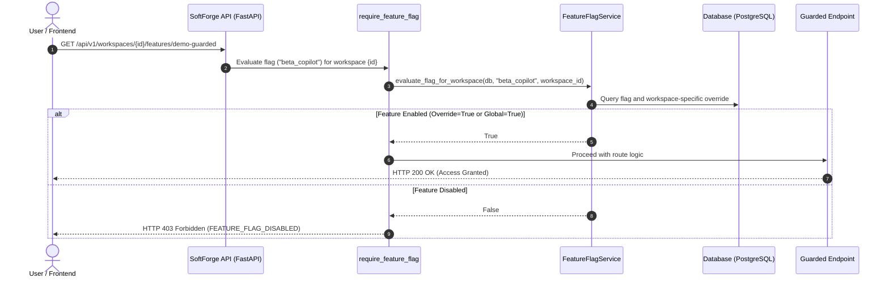

# Slice: Feature Flags & Tenant Toggles

> **Progressive rollout, dynamic beta feature activation, and granular per-workspace overrides with hierarchical fallback.**

---

## 1. Architecture Overview

The **Feature Flags & Tenant Toggles** slice (`apps/api/src/slices/feature_flags/`) provides SoftForge with the ability to safely enable, disable, or test features without requiring new deployments or database migrations in production:

- **Global Flag Catalog (`feature_flags`):** Master registry of system features with standardized slug-formatted keys (e.g., `beta_copilot`, `export_pdf`, `dark_mode_v2`).
- **Hierarchical Evaluation Order (Workspace Override > Global Default):**
  - **Global Default (`is_enabled`):** Defines whether the feature is enabled for all users by default.
  - **Workspace Override (`feature_flag_overrides`):** Allows forcing a flag on or off exclusively for a specific tenant (e.g., early access beta testers, enterprise tier customers, or tenant opt-ins).
- **Consolidated Single-Query Evaluation (`GET /workspaces/{id}/features`):** Returns a key-value dictionary (`{ "beta_copilot": true, "export_pdf": false }`) ready for frontend bootstrapping via React hooks or state stores.
- **Declarative Endpoint Guarding (`require_feature_flag`):** FastAPI dependency that intercepts requests and returns `HTTP 403 Forbidden` with the error code `FEATURE_FLAG_DISABLED` whenever the target flag is inactive for the requesting workspace.
- **Audit Logging:** Every flag creation, state mutation, override application, and deletion is recorded in `audit_logs` asynchronously through the Arq Worker.

---

## 2. Evaluation and Guard Sequence Diagram



---

## 3. API Endpoints

### Global System Management

| Method | Endpoint | Minimum Role | Description |
| :--- | :--- | :--- | :--- |
| `GET` | `/api/v1/system/features` | Authenticated | List all flags in the global system catalog. |
| `POST` | `/api/v1/system/features` | Authenticated | Register a new feature flag with an initial default state. |
| `GET` | `/api/v1/system/features/{id}` | Authenticated | Retrieve metadata for a specific flag by UUID. |
| `PATCH` | `/api/v1/system/features/{id}` | Authenticated | Update name, description, or global on/off state. |
| `DELETE`| `/api/v1/system/features/{id}` | Authenticated | Permanently delete the flag and all its associated overrides. |

### Workspace (Tenant) Evaluation & Overrides

| Method | Endpoint | Minimum Role | Description |
| :--- | :--- | :--- | :--- |
| `GET` | `/api/v1/workspaces/{id}/features` | Viewer | Returns evaluated flag dictionary for the target workspace. |
| `POST` | `/api/v1/workspaces/{id}/features/{flag_id}/override` | Admin | Force flag activation (`true`) or deactivation (`false`) for this tenant. |
| `DELETE`| `/api/v1/workspaces/{id}/features/{flag_id}/override` | Admin | Delete tenant override, restoring global default behavior. |
| `GET` | `/api/v1/workspaces/{id}/features/demo-guarded` | Viewer | Demonstration endpoint guarded by `require_feature_flag`. |

---

## 4. Protecting Endpoints in the Backend

Guard any endpoint declaratively using the `require_feature_flag` dependency:

```python
from fastapi import APIRouter, Depends
from src.slices.feature_flags.dependencies import require_feature_flag

router = APIRouter()

@router.post(
    "/workspaces/{workspace_id}/ai-copilot",
    dependencies=[Depends(require_feature_flag("ai_copilot"))],
    summary="Run AI Copilot inference",
)
async def run_ai_copilot(workspace_id: uuid.UUID) -> dict[str, str]:
    return {"status": "ok", "result": "AI generated answer"}
```

If the workspace lacks this active feature, the API immediately responds:

```json
{
  "error": "FEATURE_FLAG_DISABLED",
  "message": "A funcionalidade 'ai_copilot' está desabilitada para este workspace.",
  "details": {
    "flag_key": "ai_copilot"
  },
  "request_id": "c7a84e31-89d1-4ad9-a764-16297eb098bc"
}
```

---

## 5. Consuming Flags in the Frontend

Fetch consolidated flags upon workspace selection or dashboard load:

```typescript
import { useEvaluateWorkspaceFeatures } from "@/api/generated/featureFlagsToggles";

export function DashboardBanner({ workspaceId }: { workspaceId: string }) {
  const { data } = useEvaluateWorkspaceFeatures(workspaceId);

  if (!data?.flags?.["beta_dashboard"]) {
    return null; // Conditionally render based on active toggle
  }

  return <div className="p-4 bg-primary/10 rounded-lg">🚀 Welcome to Beta Features!</div>;
}
```
