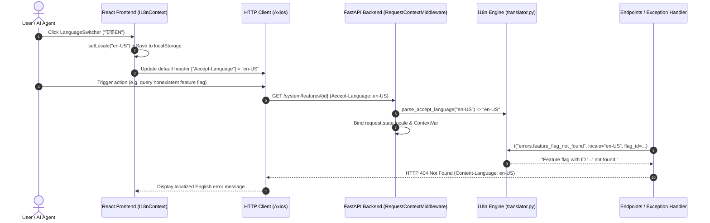

# Internationalization (i18n) & Global Localization

> **Native bilingual support (Brazilian Portuguese `pt-BR` and English `en-US`), RFC 7231 content negotiation (`Accept-Language` / `Content-Language`), and reactive synchronization across React and FastAPI.**

---

## 1. Architecture Overview

SoftForge's Internationalization engine is architected to provide a frictionless bilingual experience for both end users on the frontend and autonomous AI agents or external clients interacting via API:

- **RFC 7231 Content Negotiation:**
  - Clients communicate language preferences via the HTTP `Accept-Language` header (e.g., `en-US,en;q=0.9,pt-BR;q=0.8`).
  - Backend middleware (`RequestContextMiddleware`) computes quality weights (*q-factors*), resolves the best supported match (`pt-BR` or `en-US`), and binds it to the asynchronous task context (`ContextVar`).
  - All HTTP responses emit the standard `Content-Language: {locale}` header.
- **Dynamic API Error Translation (`AppException`):**
  - Validation errors (HTTP 422), authentication failures (HTTP 401), authorization errors (HTTP 403), missing resources (HTTP 404), rate limit blocks (HTTP 429), and domain errors are translated automatically.
- **Strictly Typed Frontend with Zero Overhead (`I18nProvider`):**
  - TypeScript dictionaries (`pt-BR.ts` and `en-US.ts`) verified at compile time: missing keys or structural mismatches trigger immediate build errors.
  - Reactive `useI18n()` hook exposing `locale`, `setLocale(locale)`, and interpolation helper `t(key, params)`.
  - Automatic `localStorage` persistence and initial detection from browser settings (`navigator.language`).
  - Synchronized Axios client: changing the active language in the UI immediately configures `Accept-Language: {locale}` for all subsequent HTTP requests.
- **Accessible Language Switcher Component (`LanguageSwitcher`):**
  - Compact toggle button allowing one-click switching between 🇧🇷 PT and 🇺🇸 EN anywhere in the user interface.

---

## 2. Internationalization Sequence Diagram



---

## 3. Diagnostic & System Endpoints

| Method | Endpoint | Recommended Header | Description |
| :--- | :--- | :--- | :--- |
| `GET` | `/api/v1/system/i18n` | `Accept-Language: en-US` | Returns detected request locale, supported framework locales, and message counts. |

### Sample Response (`GET /api/v1/system/i18n` with `Accept-Language: en-US`):

```json
{
  "current_locale": "en-US",
  "default_locale": "pt-BR",
  "supported_locales": [
    "pt-BR",
    "en-US"
  ],
  "welcome_message": "Welcome to SoftForge — AI-Native Fullstack Framework.",
  "translations_count": 16
}
```

---

## 4. Backend Usage (FastAPI)

### 4.1 Translating Messages in Services

```python
from src.core.i18n import t

# Automatically uses the locale bound to the active request:
msg = t("errors.rate_limit_exceeded", retry_after=30)
# Result in pt-BR: "Limite de requisições excedido. Tente novamente em 30s."
# Result in en-US: "Rate limit exceeded. Please try again in 30s."
```

### 4.2 Raising Localized Domain Exceptions

```python
from src.core.errors import NotFoundException

# The HTTP handler translates this automatically based on client Accept-Language:
raise NotFoundException(
    message=f"Workspace with ID '{workspace_id}' not found",
    message_key="errors.workspace_not_found",
    message_kwargs={"workspace_id": str(workspace_id)},
)
```

---

## 5. Frontend Usage (React)

### 5.1 Using the `useI18n` Hook

```tsx
import { useI18n } from "@/core/i18n";

export function HeaderTitle() {
  const { t } = useI18n();

  return (
    <div>
      <h1>{t("nav.dashboard")}</h1>
      <p>{t("system.welcome")}</p>
    </div>
  );
}
```

### 5.2 Embedding the Language Switcher

```tsx
import { LanguageSwitcher } from "@/core/i18n";

export function TopBar() {
  return (
    <div className="flex justify-between items-center p-4">
      <span>SoftForge App</span>
      <LanguageSwitcher variant="button" />
    </div>
  );
}
```
