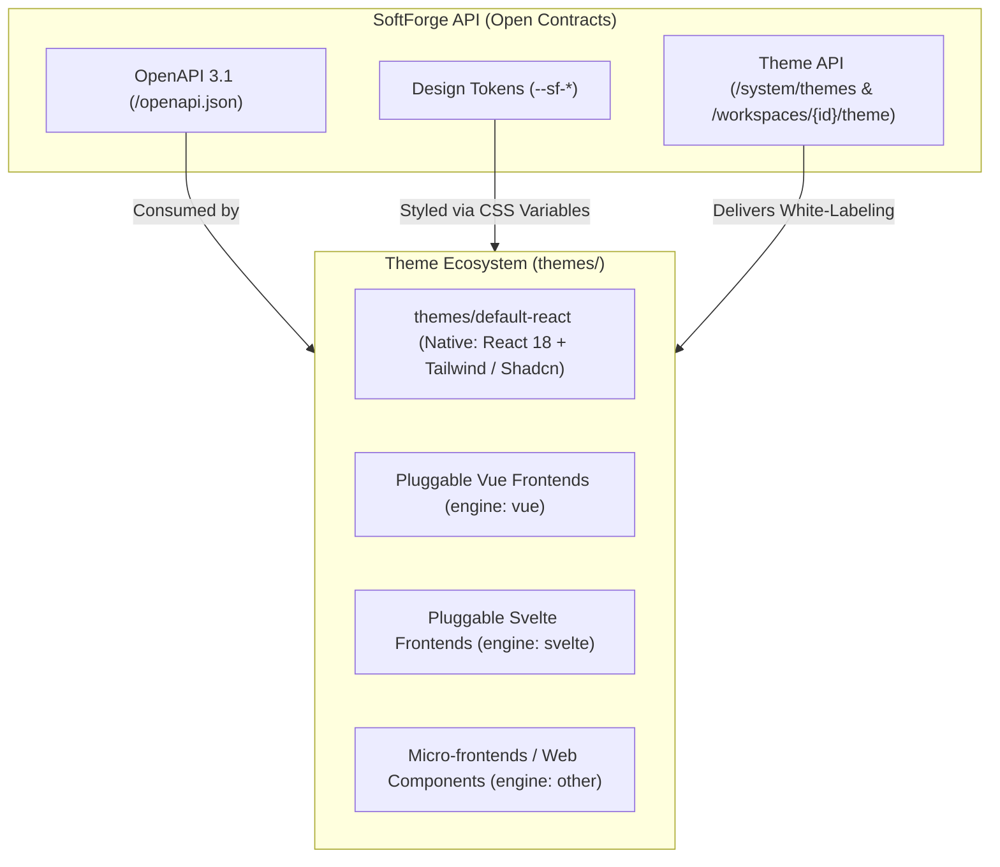

# Theme System & Pluggable Multi-Frontends

> **Open, decoupled architecture delivering the native Default React Theme (React 18 + Tailwind / Shadcn) while allowing any modern interface (Vue, Svelte, micro-frontends) to connect over the exact same SoftForge API and open contracts.**

---

## 1. Architecture Overview

SoftForge eliminates frontend vendor lock-in. It is intentionally designed so that human engineers and **autonomous AI agents** can leverage the official React implementation or attach any modern visual framework:



### Core Architectural Principles
1. **OpenAPI 3.1 Contracts as the Universal Bridge:** Any frontend (the native React SPA, a Vue client, or Svelte application) calls the exact same authenticated endpoints (via HttpOnly cookies or `Authorization: Bearer` tokens).
2. **Universal Design Tokens (`--sf-*`):** Colors, border radii, and typography are injected as native CSS variables that map naturally to Tailwind (`bg-primary`), CSS variables, or design system tokens.
3. **Theme Manifest (`softforge-theme.json`):** Standardized declarative manifest defining the theme engine (`"react"`, `"vue"`, `"svelte"`, `"other"`), metadata, and token defaults.
4. **Per-Workspace White-Labeling:** Every customer or tenant can have their custom branding (logo, primary color, and custom CSS) evaluated and injected dynamically.

---

## 2. The Theme Manifest (`softforge-theme.json`)

Every theme located in the root `themes/{theme-name}/` folder includes a declarative manifest validated by `theme-schema.json`:

```json
{
  "$schema": "../theme-schema.json",
  "name": "SoftForge Default React",
  "slug": "default-react",
  "version": "1.0.0",
  "engine": "react",
  "author": "SoftForge Core Team",
  "description": "Official default theme built on React 18, Vite, Tailwind CSS, and Shadcn/UI accessible primitives.",
  "tokens": {
    "colors": {
      "primary": "#2563eb",
      "primary_foreground": "#f8fafc",
      "background": "#ffffff",
      "foreground": "#0f172a",
      "card": "#ffffff",
      "card_foreground": "#0f172a",
      "border": "#e2e8f0",
      "muted": "#f1f5f9",
      "muted_foreground": "#64748b",
      "accent": "#f1f5f9"
    },
    "typography": {
      "font_family": "Inter, system-ui, -apple-system, sans-serif",
      "font_size_base": "16px",
      "line_height": "1.5"
    },
    "geometry": {
      "border_radius": "0.5rem"
    }
  },
  "assets": {
    "stylesheets": [
      "/src/index.css"
    ],
    "scripts": [
      "/src/main.tsx"
    ]
  }
}
```

---

## 3. Universal Design Tokens Mapping

Tokens are injected into the HTML `:root` element for immediate use across different styling systems:

| Universal Token | CSS Variable | Tailwind Mapping | Native CSS Application |
| :--- | :--- | :--- | :--- |
| Primary Color | `--sf-color-primary` | `bg-primary` / `text-primary` | `var(--sf-color-primary)` |
| Background | `--sf-color-bg` | `bg-background` | `var(--sf-color-bg)` |
| Text Color | `--sf-color-text` | `text-foreground` | `var(--sf-color-text)` |
| Card / Surface | `--sf-color-card` | `bg-card` | `var(--sf-color-card)` |
| Border | `--sf-color-border` | `border-border` | `var(--sf-color-border)` |
| Border Radius | `--sf-radius` | `rounded-lg` | `var(--sf-radius)` |
| Main Font | `--sf-font-family` | `font-sans` | `var(--sf-font-family)` |

---

## 4. Connecting a New Frontend or Custom Theme

The Multi-Frontend architecture allows external or alternative frontends to plug in seamlessly:

1. **Create the theme folder at `themes/<theme-name>/`**.
2. **Add `softforge-theme.json`** with the appropriate engine (`"react"`, `"vue"`, `"svelte"`, or `"other"`):
   ```json
   {
     "$schema": "../theme-schema.json",
     "name": "My Custom Vue Theme",
     "slug": "my-custom-vue",
     "version": "1.0.0",
     "engine": "vue",
     "tokens": {
       "colors": {
         "primary": "#42b883"
       }
     }
   }
   ```
3. **Consume SoftForge API Endpoints:**
   - Retrieve workspace tokens via `GET /api/v1/workspaces/{id}/theme`.
   - Apply the returned `css_variables` map directly to the `:root` element.
   - Interact with standard OpenAPI routes (`/api/v1/projects`, `/api/v1/auth`, etc.).

---

## 5. Backend Theme & White-Labeling Endpoints

| Method | Endpoint | Minimum Role | Description |
| :--- | :--- | :--- | :--- |
| `GET` | `/api/v1/system/themes` | Public / Authenticated | Lists all themes and frontend engines installed in `themes/`. |
| `GET` | `/api/v1/system/themes/{slug}` | Public / Authenticated | Returns full manifest and design tokens for the specified theme slug. |
| `GET` | `/api/v1/workspaces/{id}/theme` | Viewer | Returns evaluated theme and branding variables for this workspace. |
| `PATCH`| `/api/v1/workspaces/{id}/theme` | Admin | Updates custom logo, primary color, active theme, or custom CSS. |
