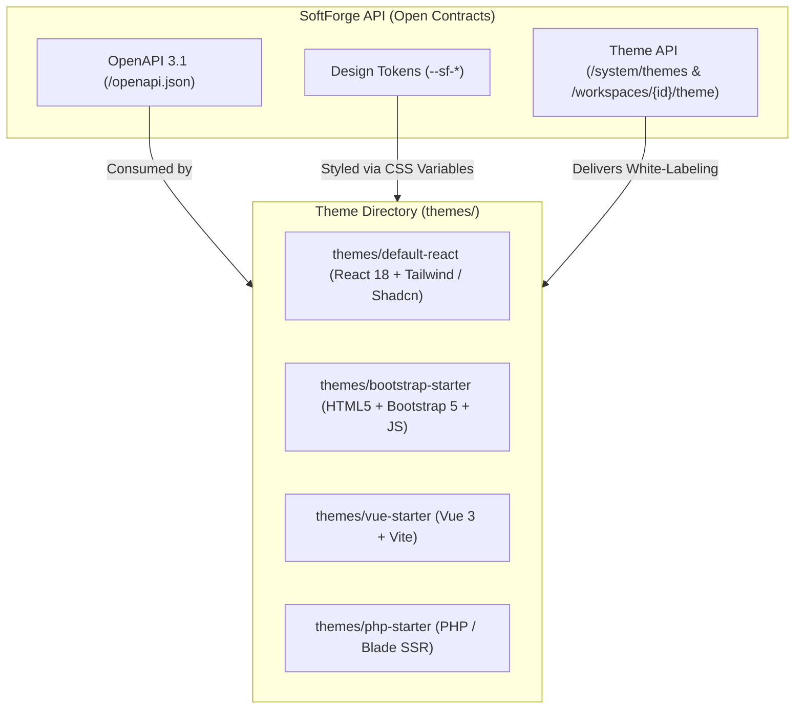

# Theme System & Pluggable Multi-Frontends

> **Open, decoupled architecture allowing interfaces built with React, Vue, classical Bootstrap 5 / HTML, Blade/PHP, or HTMX over the exact same SoftForge API and OpenAPI contracts.**

---

## 1. Architecture Overview

SoftForge does not enforce a single frontend technology. It is intentionally designed so that human developers and **autonomous AI agents** can seamlessly use, swap, or generate user interfaces using whichever library, framework, or template engine the customer prefers:



### Core Architectural Principles
1. **OpenAPI 3.1 Contracts as the Universal Bridge:** Any frontend (whether a React SPA, a Vue app, or PHP server-side templates) calls the exact same authenticated endpoints (via HttpOnly cookies or `Authorization: Bearer` tokens).
2. **Universal Design Tokens (`--sf-*`):** Colors, border radii, and typography are injected as native CSS variables that map naturally to Tailwind (`bg-primary`), Bootstrap 5 (`--bs-primary`), vanilla CSS, or template engines.
3. **Theme Manifest (`softforge-theme.json`):** Standardized file declaring the engine, metadata, and token defaults for each theme.
4. **Per-Workspace White-Labeling:** Every customer or tenant can have their custom branding (logo, primary color, and custom CSS) evaluated and injected dynamically.

---

## 2. The Theme Manifest (`softforge-theme.json`)

Every theme located in the root `themes/{theme-name}/` folder includes a declarative manifest:

```json
{
  "$schema": "./theme-schema.json",
  "name": "SoftForge Bootstrap Admin",
  "slug": "bootstrap-starter",
  "version": "1.0.0",
  "engine": "html-bootstrap",
  "author": "SoftForge Team",
  "description": "High-compatibility classical admin theme built on Bootstrap 5 and Vanilla JS.",
  "tokens": {
    "colors": {
      "primary": "#4f46e5",
      "primary_foreground": "#ffffff",
      "background": "#ffffff",
      "foreground": "#0f172a",
      "card": "#f8fafc",
      "border": "#e2e8f0",
      "muted": "#64748b"
    },
    "typography": {
      "font_family": "system-ui, -apple-system, sans-serif"
    },
    "geometry": {
      "border_radius": "0.5rem"
    }
  }
}
```

---

## 3. Universal Design Tokens Mapping

Tokens are injected into the HTML `:root` element for immediate use across different styling engines:

| Universal Token | CSS Variable | Tailwind Mapping | Bootstrap 5 Mapping |
| :--- | :--- | :--- | :--- |
| Primary Color | `--sf-color-primary` | `bg-primary` / `text-primary` | `--bs-primary` / `.btn-primary` |
| Background | `--sf-color-bg` | `bg-background` | `--bs-body-bg` / `bg-body` |
| Text Color | `--sf-color-text` | `text-foreground` | `--bs-body-color` / `text-body` |
| Card / Surface | `--sf-color-card` | `bg-card` | `.card` / `bg-light` |
| Border | `--sf-color-border` | `border-border` | `--bs-border-color` |
| Border Radius | `--sf-radius` | `rounded-lg` | `--bs-border-radius` |

---

## 4. Creating a New Theme (Step by Step)

### Example: HTML5 + Bootstrap 5 Theme
1. Create the theme directory at `themes/my-bootstrap-theme/`.
2. Add `softforge-theme.json` with `engine: "html-bootstrap"`.
3. Create `index.html` importing Bootstrap CSS and referencing `--sf-*` variables:

```html
<!DOCTYPE html>
<html lang="en">
<head>
  <meta charset="UTF-8">
  <title>SoftForge Dashboard</title>
  <link rel="stylesheet" href="https://cdn.jsdelivr.net/npm/bootstrap@5.3.3/dist/css/bootstrap.min.css">
  <style>
    :root {
      --bs-primary: var(--sf-color-primary, #4f46e5);
      --bs-border-radius: var(--sf-radius, 0.5rem);
    }
  </style>
</head>
<body class="bg-light">
  <div class="container py-5">
    <h1 class="h3 mb-4">SoftForge Panel (Bootstrap 5)</h1>
    <div id="projects-container" class="row g-3">
      <!-- Loaded dynamically via fetch('/api/v1/projects') -->
    </div>
  </div>
  <script>
    fetch('/api/v1/projects', { credentials: 'include' })
      .then(res => res.json())
      .then(data => console.log('Loaded projects:', data));
  </script>
</body>
</html>
```

---

## 5. Backend Theme & White-Labeling Endpoints

| Method | Endpoint | Minimum Role | Description |
| :--- | :--- | :--- | :--- |
| `GET` | `/api/v1/system/themes` | Public / Authenticated | Lists all themes and frontend engines installed in `themes/`. |
| `GET` | `/api/v1/system/themes/{slug}` | Public / Authenticated | Returns full manifest and design tokens for the specified theme slug. |
| `GET` | `/api/v1/workspaces/{id}/theme` | Viewer | Returns evaluated theme and branding variables for this workspace. |
| `PATCH`| `/api/v1/workspaces/{id}/theme` | Admin | Updates custom logo, primary color, active theme, or custom CSS. |
