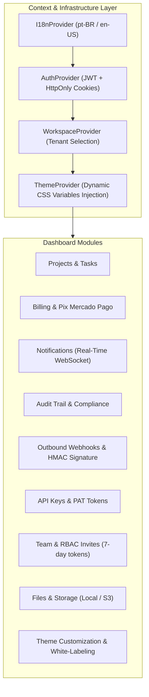

# Frontend Visual Interface & Unified Dashboard

> **Modular administrative dashboard built with React 18, Vite, and Tailwind CSS, integrating 100% of SoftForge vertical slices into a high-productivity visual experience.**

---

## 1. Visual Architecture Overview

The SoftForge frontend (`apps/web`) operates as a decoupled Single Page Application (SPA), organized around business slices and powered by OpenAPI 3.1 contracts:



---

## 2. Dynamic Design Tokens Injection (`ThemeProvider`)

The `ThemeProvider` in `apps/web/src/core/theme/` dynamically syncs design variables into the DOM:

1. **Theme API Fetching:** When switching workspaces, requests `GET /api/v1/workspaces/{id}/theme`.
2. **`--sf-*` Injection:** Injects canonical CSS variables (`--sf-color-primary`, `--sf-color-bg`, `--sf-radius`) into `:root`.
3. **HSL Mapping for Tailwind:** Translates hexadecimal color values to HSL (`H S% L%`) and updates Tailwind's native `--primary` variable, immediately repainting buttons, badges, and active rings with the tenant's brand color.
4. **Custom CSS:** Injects or updates `<style id="sf-workspace-custom-css">` for Enterprise tenants.

---

## 3. Functional Dashboard Modules

| Module | Component | Visual Experience Description |
| :--- | :--- | :--- |
| **Projects** | `ProjectsView` | Software projects or AI task goals, card listing, inline task expansion and statuses. |
| **Billing & Pix** | `BillingView` | Plan comparison (Free, Pro, Enterprise), active subscription status, and transparent Pix modal with QR Code and Copy-and-Paste key. |
| **Notifications** | `NotificationsView` / `NotificationBell` | Real-time WebSocket connection with ping/pong, topbar bell with unread badge count, and alert feed with mark-as-read. |
| **Audit** | `AuditView` | Filterable table of audit events with text search across action, user, source IP, and timestamp. |
| **Webhooks** | `WebhooksView` | Outbound destination endpoint management, masked HMAC secret toggle, and delivery history logs. |
| **API Keys** | `ApiKeysView` | PAT generation with one-time secret revelation notice, masked prefixes, and instant revocation. |
| **Team & RBAC** | `MembersView` | Collaborator table with roles (Owner, Admin, Member, Viewer) and 7-day signed invite link dispatch. |
| **Storage & Files**| `StorageView` | File uploads with formatted size (KB/MB), MIME type icons, and direct download links. |
| **Themes & Branding**| `ThemesView` | Installed system theme catalog, live primary color picker with instant preview, custom logo, and CSS editor. |

---

## 4. Real-Time WebSocket Communication

The `NotificationBell` component maintains a persistent, full-duplex WebSocket connection:

```typescript
const wsUrl = `${protocol}//${host}/api/v1/notifications/ws?token=${token}`;
const ws = new WebSocket(wsUrl);

ws.onmessage = (event) => {
  const data = JSON.parse(event.data);
  if (data.type === "pong") return;
  // Live notification push
  setUnreadCount((prev) => prev + 1);
};
```
