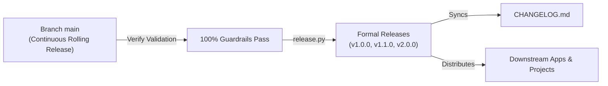

# Versioning & Release Policy

> **SemVer Governance, Lifecycle Management, and Releases in SoftForge**  
> *Semantic Versioning 2.0.0 • Rolling Main • Single Monorepo Version • Continuous CHANGELOG*

---

## 1. Overview and Philosophy

**SoftForge** is built for both human engineers and **Autonomous AI Agents** constructing production-grade applications.

To balance rapid continuous innovation with operational predictability, we implement the **Hybrid SemVer** model:



1. **`main` Branch (Continuous Rolling Release):**  
   The primary branch is always in a deployable, green state. Every commit passes 100% of static types, linters, and integration tests via `verify.py`.
2. **Formal SemVer Releases (`vX.Y.Z`):**  
   Milestones frozen in time with annotated Git tags, accompanied by comprehensive notes in `CHANGELOG.md` and GitHub Releases.
3. **Single Global Version (Monorepo):**  
   The Backend API (`apps/api`), Frontend (`apps/web`), Themes (`themes/`), AI Skills, and Documentation advance in unison under the exact same version number.

---

## 2. SemVer 2.0.0 Structure (`MAJOR.MINOR.PATCH`)

```text
       v 1 . 2 . 4
         │   │   │
         │   │   └── PATCH: Bug fixes, security patches, docs (no API changes)
         │   └────── MINOR: New vertical slices, new themes, backwards-compatible routes
         └────────── MAJOR: Breaking contract changes, route removals, destructive migrations
```

### 1. MAJOR (`vX.0.0`)
- **When it applies:** Any modification breaking compatibility with existing contracts.
- **Examples in SoftForge:**
  - Removing or altering fields in OpenAPI schemas without backwards compatibility.
  - Destructive database alterations (dropping or renaming columns/tables).
  - Breaking changes to the `softforge-theme.json` specification or `--sf-*` CSS variables.
- **Transition Policy:** Landed directly in MAJOR with:
  1. Reversible Alembic migrations.
  2. Step-by-step upgrade guide documented in `CHANGELOG.md`.

### 2. MINOR (`v1.X.0`)
- **When it applies:** New features and vertical slices added in a 100% backwards-compatible manner.
- **Examples in SoftForge:**
  - Adding a new vertical slice to `apps/api/src/slices/` (e.g., `billing`, `storage`).
  - Adding new HTTP endpoints or optional schema fields.
  - Additive database migrations (new tables or columns with default values).
  - Adding new themes to `themes/`.
  - Adding new skills to `.agents/skills/`.

### 3. PATCH (`v1.0.X`)
- **When it applies:** Bug fixes, security patches, documentation, and internal optimizations.
- **Examples in SoftForge:**
  - Fixing an edge case in `service.py`.
  - UI fixes or responsiveness adjustments in `apps/web`.
  - Dependency upgrades resolving CVEs.
  - Fixing typos and links in `docs/`.

---

## 3. Release Automation with `release.py`

SoftForge includes a dedicated CLI release utility:

```bash
# Run guardrails, sync manifests, generate changelog, and create Git tag:
python tools/scripts/release.py --bump minor --tag -m "Add team invites vertical slice"

# Or specify an explicit target version:
python tools/scripts/release.py --version 1.0.0 --tag -m "Official GA Release"
```

### Script Execution Sequence:
1. **Guardrails Gate:** Executes `python tools/scripts/verify.py`. If any check fails, the release halts immediately.
2. **Version Synchronization:** Updates `apps/api/pyproject.toml`, `apps/web/package.json`, and `docs/package.json`.
3. **Changelog Generation:** Inspects recent Conventional Commits and prepends the new version block to `CHANGELOG.md`.
4. **Git Commit and Tag:** Commits with `chore(release): release vX.Y.Z` and tags `vX.Y.Z`.

---

## 4. Keeping Downstream Projects Up to Date

To keep applications created with SoftForge synced with upstream improvements:

```bash
# Add upstream repository:
git remote add upstream https://github.com/omauriciofala/softforge.redepronta.com.git

# Fetch latest releases and tags:
git fetch upstream --tags

# Merge a specific stable release:
git merge v1.1.0
```

Apply any new database migrations:
```bash
python tools/scripts/migrate.py upgrade
python tools/scripts/verify.py
```
