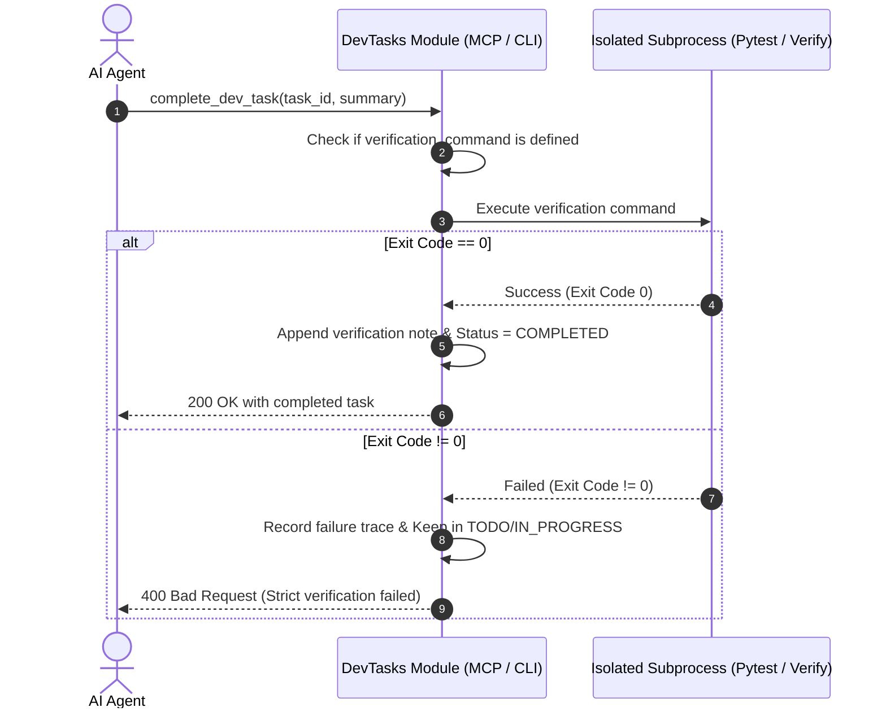

# 22. Slice: Development Task Manager & AI MCP Server

> **Native Slice:** `apps/api/src/slices/dev_tasks/`  
> **Convenience Wrapper:** `python tools/scripts/dev_tasks.py`  
> **MCP Protocol:** Native JSON-RPC 2.0 over `stdio` (zero extra dependencies)  
> **Philosophy:** Andrej Karpathy Principle 4 (*Goal-Driven Execution & Automated Verification*)

---

## 1. Overview

The **DevTasks** slice (`dev_tasks`) is an independent module within SoftForge designed for both human engineers and **Autonomous AI Agents** (Google Antigravity, Claude Code, Cursor, Windsurf) to manage and advance software development lifecycles.

Unlike generic todo items, development tasks model technical reality:
- **Target Files (`target_files`):** Explicit surgical scope boundaries.
- **Acceptance Criteria (`acceptance_criteria`):** Unambiguous completion checklists.
- **Verification Command (`verification_command`):** Automated deterministic test/guardrail command.
- **Technical Notes History (`notes`):** Granular audit trail of agent progress, decisions, and roadblocks.

---

## 2. Direct Database Access (Zero Uvicorn Dependency)

A key benefit for autonomous agents and CLI workflows:
- Both the **CLI** and the **MCP Server** connect directly to the database via async SQLAlchemy.
- You do **not** need the FastAPI HTTP server running on port 8000 for agents or scripts to query, claim, update, or resolve tasks.
- Local SQLite database and default development workspaces are automatically auto-initialized on demand.

---

## 3. Strict Verification Guardrail

In accordance with SoftForge's non-negotiable Karpathy principles (*"Never declare victory without automated verification"*):



---

## 4. Command Line Usage (CLI)

```bash
# List pending tasks
python tools/scripts/dev_tasks.py list --status todo

# Create a technical task
python tools/scripts/dev_tasks.py create \
  --title "Implement WebAuthn Authentication" \
  --desc "Add passkeys support to auth slice" \
  --target-files "apps/api/src/slices/auth/passkeys.py" \
  --criteria "Unit tests pass,OpenAPI spec exported" \
  --verify-cmd "pytest apps/api/src/slices/auth/tests/test_passkeys.py"

# Claim task for an agent
python tools/scripts/dev_tasks.py claim <TASK_ID> --agent "antigravity"

# Log progress note
python tools/scripts/dev_tasks.py note <TASK_ID> --content "Initial schemas created."

# Complete task (triggers automated verification)
python tools/scripts/dev_tasks.py complete <TASK_ID> --summary "Passkeys implemented and verified."

# Report a blocker
python tools/scripts/dev_tasks.py fail <TASK_ID> --reason "External API key missing" --blocked
```

---

## 5. Model Context Protocol (MCP) Integration

Configure the MCP server in your AI agent client (Antigravity, Claude Code, Cursor):

```json
{
  "mcpServers": {
    "softforge-dev-tasks": {
      "command": "python",
      "args": ["tools/scripts/dev_tasks.py", "mcp"]
    }
  }
}
```

Exposed native tools:
- `list_dev_tasks`
- `get_dev_task`
- `create_dev_task`
- `claim_dev_task`
- `log_dev_task_progress`
- `complete_dev_task`
- `fail_dev_task`
