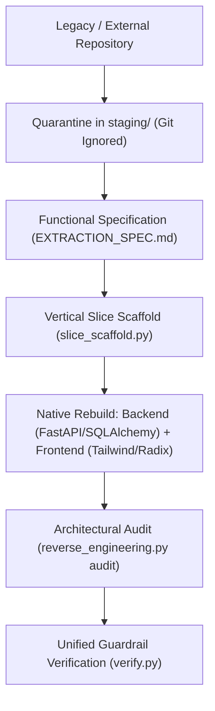

# Reverse Engineering and Safe Legacy Migration

SoftForge was built from the ground up for seamless cooperation between human developers and autonomous AI agents. One of the most common tasks when modernizing software is **incorporating capabilities from existing repositories, external projects, or legacy systems**.

To execute this process without compromising the codebase, SoftForge establishes a **Quarantine Staging Area (`staging/`)** and enforces the **Pure Functional Extraction** principle.

---

## 1. Core Principles



### 1.1 Non-Negotiable Quarantine (Zero Pollution)
- No external or legacy files should ever be cloned or placed directly into `apps/api/`, `apps/web/`, or `tools/`.
- All legacy codebases must reside in `staging/<system_name>/`.
- SoftForge's `.gitignore` automatically ignores `staging/*`. Heavy external dependencies (`node_modules/`, `venv/`), database dumps, or legacy secrets will **never** be committed.

### 1.2 Pure Functional Extraction (Zero Stack Distortion)
- We do not port or "translate" legacy code line-by-line.
- We extract **exclusively business capabilities**:
  - Conceptual data models and fields -> Converted to SQLAlchemy 2.0 inheriting from `src.core.database.Base`.
  - Endpoints and contracts -> Converted to FastAPI and strict Pydantic v2 schemas.
  - Calculation rules, validations, and state workflows -> Implemented as pure async functions in `service.py`.
- Foreign backend libraries (Django ORM, Express, TypeORM, Prisma, etc.) are **never** installed or imported.

### 1.3 Absolute Preservation of the Design System (Zero UI Distortion)
- **Strict Prohibition:** NEVER copy legacy stylesheets (`.css`, `.scss`, `.less`), legacy CSS framework classes (Bootstrap, Ant Design, Material-UI, Bulma), or jQuery scripts.
- Every user interface in SoftForge is built from scratch in `apps/web/src/features/<slice>/` using:
  - Official UI primitives in `apps/web/src/components/ui/` (Radix UI / Shadcn).
  - Tailwind CSS v3 utility classes and active theme tokens.
  - Icons from `lucide-react`.
  - Standardized HTTP client (`@/lib/api-client`).

---

## 2. Built-in Tooling (`tools/scripts/reverse_engineering.py`)

SoftForge provides a CLI assistant to guide the reverse engineering lifecycle safely:

### 2.1 Initialize a Quarantine Workspace
To set up an isolated staging folder and extraction specification for a new system:
```bash
python tools/scripts/reverse_engineering.py init --name legacy-crm
```
This command generates:
```text
staging/legacy-crm/
├── .gitignore             # Defense-in-depth isolation
├── EXTRACTION_SPEC.md     # Mapping template for models and rules
└── source/                # Directory where original source code is placed
```

### 2.2 List Quarantined Projects
```bash
python tools/scripts/reverse_engineering.py list
```

### 2.3 Audit Slice Compliance
After implementing the vertical slice, verify that all SoftForge invariants are met and no foreign code leaked into the codebase:
```bash
python tools/scripts/reverse_engineering.py audit --slice <slice_name>
```

---

## 3. Step-by-Step Execution Workflow

1. **Initialization:**
   Run `python tools/scripts/reverse_engineering.py init --name <system>`.
2. **Load Legacy Code:**
   Copy files or clone the legacy repo into `staging/<system>/source/`.
3. **Map Domain & Rules:**
   Fill out `staging/<system>/EXTRACTION_SPEC.md` mapping entities, endpoints, business rules, and user journeys.
4. **Scaffold Slice:**
   Generate the vertical slice skeleton:
   ```bash
   python tools/scripts/slice_scaffold.py --name <slice_name>
   ```
5. **Backend Implementation:**
   - Update `models.py` with typed columns, `Base` inheritance, and `workspace_id`.
   - Configure strict Pydantic v2 DTOs in `schemas.py`.
   - Implement business logic in `service.py` using `AsyncSession`.
   - Protect routes in `router.py` using `require_workspace_role(...)`.
   - Write full integration tests in `tests/test_<slice_name>_slice.py`.
6. **Frontend Implementation:**
   - Create feature directory in `apps/web/src/features/<slice_name>/`.
   - Build UI exclusively using SoftForge components (`Card`, `Button`, `Table`, etc.).
7. **Audit & Verification:**
   ```bash
   python tools/scripts/reverse_engineering.py audit --slice <slice_name>
   python tools/scripts/export_openapi.py
   python tools/scripts/verify.py
   ```
8. **Completion:**
   The `staging/<system>/` folder can be kept locally for reference or removed, with zero risk to the Git repository or production builds.
