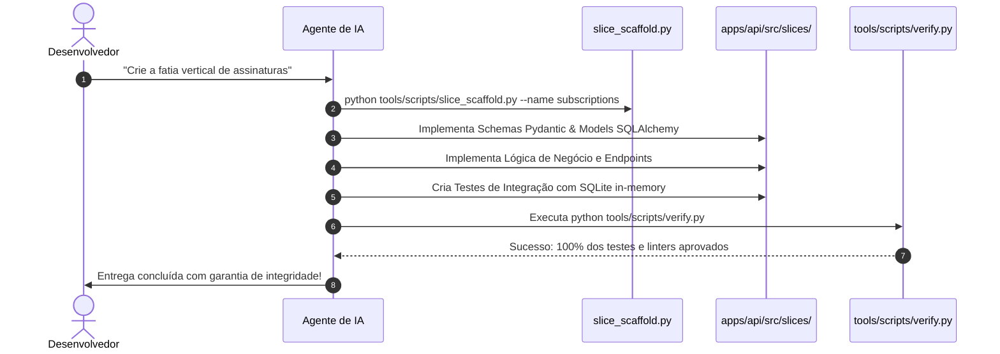

# Fluxo de Desenvolvimento com IA

> **Como Agentes Autônomos e Engenheiros Constroem no SoftForge**  
> *Cursor, Antigravity, Claude Code, GitHub Copilot e Modelos LLM.*

---

## 1. O Papel do `.ai/AGENTS.md`

Ao abrir este repositório em ferramentas como Cursor, Claude Code ou Antigravity, o arquivo [.ai/AGENTS.md](../../.ai/AGENTS.md) funciona como a **Constituição do Projeto** para o modelo de linguagem:
- Ele define as regras que a IA NUNCA deve quebrar.
- Explica o padrão das fatias verticais e convenções de nomenclatura.
- Estabelece os guardrails que o modelo precisa executar antes de entregar o código pronto.

---

## 2. O Ciclo Determinístico em 6 Etapas

Quando você pedir a uma IA para implementar qualquer funcionalidade (ex: *"Crie um módulo de assinaturas e planos com checkout"*), a IA seguirá este fluxo determinístico:



---

## 3. Prompts Recomendados para Guiar a IA

### Exemplo 1: Criando uma nova fatia
```text
Siga estritamente as diretrizes em .ai/AGENTS.md.
Execute o scaffold de uma nova fatia chamada 'invoices' usando tools/scripts/slice_scaffold.py.
Implemente os campos de valor, cliente_id, vencimento e status (pendente, pago, cancelado).
Adicione testes cobrindo todo o ciclo e execute verify.py para certificar a entrega.
```

### Exemplo 2: Adicionando uma regra a uma fatia existente
```text
Abra apps/api/src/slices/projects/.
Adicione um campo 'priority' com valores 'low', 'medium' e 'high' no schema e model de tarefas.
Atualize os testes correspondentes e certifique-se de que export_openapi.py e verify.py passem sem erros.
```
