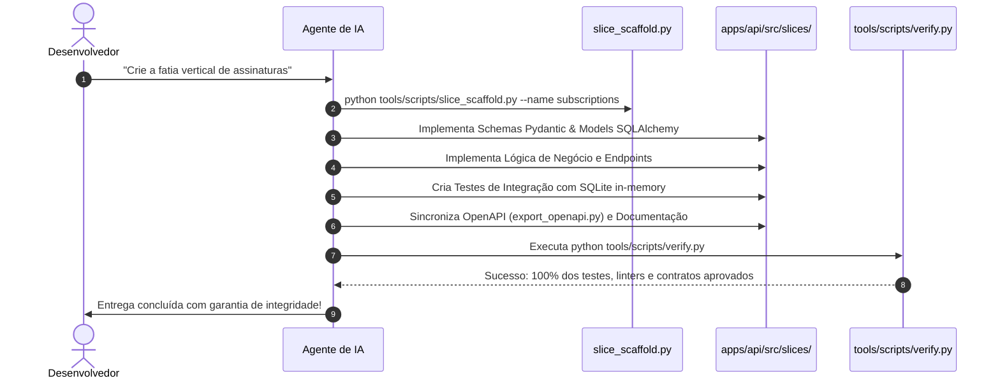
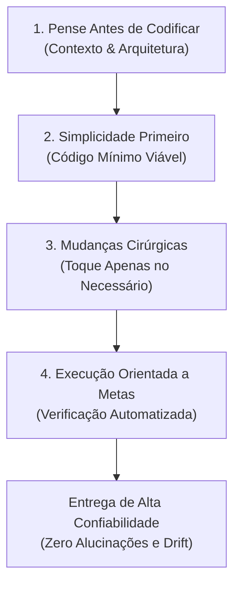

# Fluxo de Desenvolvimento com IA

> **Como Agentes Autônomos e Engenheiros Constroem no SoftForge**  
> *Cursor, Antigravity, Claude Code, GitHub Copilot e Modelos LLM.*

---

## 1. O Papel do `AGENTS.md` e `.ai/AGENTS.md`

Ao abrir este repositório em ferramentas como Cursor, Claude Code ou Antigravity, o arquivo [AGENTS.md](../../AGENTS.md) funciona como a **Constituição do Projeto** para o modelo de linguagem:
- Ele define as regras que a IA NUNCA deve quebrar.
- Explica o padrão das fatias verticais e convenções de nomenclatura.
- Estabelece os guardrails que o modelo precisa executar antes de entregar o código pronto.
- Conecta a IA à Skill Canônica [.agents/skills/karpathy-guidelines/SKILL.md](../../.agents/skills/karpathy-guidelines/SKILL.md).

---

## 2. O Ciclo Determinístico em 7 Etapas

Quando você pedir a uma IA para implementar qualquer funcionalidade (ex: *"Crie um módulo de assinaturas e planos com checkout"*), a IA seguirá este fluxo determinístico:



---

## 3. Diretrizes de Engenharia de Andrej Karpathy para IA

O SoftForge integra nativamente a filosofia de engenharia de software assistida por LLMs formulada por **Andrej Karpathy** (pesquisador e ex-diretor de IA na Tesla e cofundador da OpenAI).

A skill canônica reside em `.agents/skills/karpathy-guidelines/SKILL.md` e estabelece 4 pilares:



### 1. Pense Antes de Codificar (Think Before Coding)
- **Inspeção de Contexto:** Antes de alterar código, a IA lê arquivos de schema, rotas existentes e entidades do banco.
- **Exposição de Trade-offs:** Em decisões ambíguas (ex: banco relacional vs Redis, síncrono vs background worker), a IA apresenta prós e contras antes de codificar.
- **Defesa da Arquitetura:** O modelo recusa designs que quebrem o isolamento das fatias verticais ou violem o multi-tenancy (`workspace_id`).
- **Esclarecimento:** Se uma especificação estiver incompleta, a IA faz perguntas diretas em vez de assumir intenções.

### 2. Simplicidade em Primeiro Lugar (Simplicity First)
- **Código Mínimo:** Implementa a solução mais direta e robusta sem código especulativo.
- **Zero Abstrações Prematuras:** Proibido criar repositórios genéricos ou camadas extras não solicitadas.
- **Linearidade:** Prefere fluxos claros e idiomáticos a padrões rebuscados.

### 3. Modificações Cirúrgicas (Surgical Changes)
- **Escopo Restrito:** Apenas os arquivos e linhas necessários para o objetivo são modificados.
- **Respeito ao Legado:** NUNCA reformata código alheio, reorganiza imports fora do escopo ou altera estilos estabelecidos.
- **Preservação Documental:** Todos os comentários, docstrings e manuais existentes são conservados.
- **Rastro Limpo:** Remove scripts temporários, prints de depuração e rascunhos antes de finalizar.

### 4. Execução Orientada a Metas e Verificação (Goal-Driven Execution)
- **Critérios Objetivos:** Define antecipadamente o teste de sucesso.
- **Testes Automatizados:** Testes de integração em `tests/test_<feature>_slice.py` com SQLite em memória.
- **Portão Único:** Executa o script mestre `python tools/scripts/verify.py` e só conclui após aprovação de 100%.

---

## 4. Matriz de Compatibilidade Multi-IA

O SoftForge provê pontes de descoberta universais para qualquer assistente de IA do mercado:

| Assistente / Ferramenta | Ponto de Entrada | Função |
| :--- | :--- | :--- |
| **Google Antigravity** | `.agents/skills/karpathy-guidelines/SKILL.md` | Skill canônica com carregamento sob demanda |
| **Google Antigravity & Rules** | `.agents/rules/karpathy-guidelines.md` | Regras ativas em tempo real na edição |
| **Claude Code** | `CLAUDE.md` | Configuração raiz e atalhos de comando |
| **Cursor & Windsurf** | `AGENTS.md` e `.ai/rules/` | Instruções mestras e regras hierárquicas |
| **GitHub Copilot** | `.github/copilot-instructions.md` | Prompts de contexto para chat e inline |
| **LLMs Universais** | `AGENTS.md` | Constituição mestra no topo do repositório |

---

## 5. Scaffolder & Inicialização de Projetos com IA

Ao inicializar qualquer novo projeto ou criar uma fatia vertical com o SoftForge, o ambiente de IA é configurado automaticamente:

### Sincronização Geral de IA:
```bash
# Inicializa ou atualiza skills e regras de IA em qualquer pasta de projeto
python tools/scripts/init_project_ai.py
```

### Criando fatias verticais com suporte a IA:
```bash
# Cria o esqueleto completo da fatia com lembretes Karpathy
python tools/scripts/slice_scaffold.py --name invoices

# Ou inicialize as regras e skills diretamente pelo scaffolder:
python tools/scripts/slice_scaffold.py --init-ai
```

---

## 6. Prompts Recomendados para Guiar a IA

### Exemplo 1: Criando uma nova fatia
```text
Siga estritamente as diretrizes em AGENTS.md e os princípios Karpathy.
Execute o scaffold de uma nova fatia chamada 'invoices' usando tools/scripts/slice_scaffold.py.
Implemente os campos de valor, cliente_id, vencimento e status (pendente, pago, cancelado).
Adicione testes cobrindo todo o ciclo e execute verify.py para certificar a entrega.
```

### Exemplo 2: Adicionando uma regra a uma fatia existente
```text
Abra apps/api/src/slices/projects/.
Adicione um campo 'priority' com valores 'low', 'medium' e 'high' no schema e model de tarefas.
Atualize os testes correspondentes e certifique-se de que export_openapi.py e verify.py passem sem erros.
```
