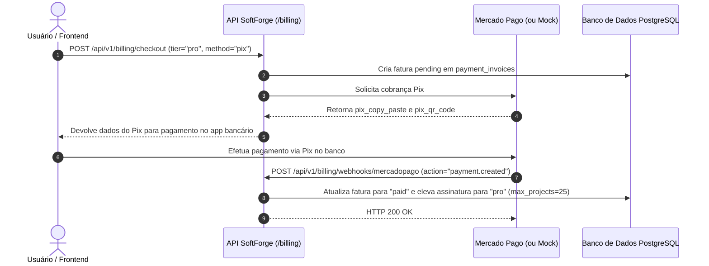

# Fatia Vertical: Billing & Assinaturas (Mercado Pago)

> **Motor de Faturamento Híbrido, Pix Transparente, Boleto, Gestão de Planos e Controle de Quotas para SaaS.**

---

## 1. Visão Geral da Fatia

A fatia `billing` (`apps/api/src/slices/billing/`) implementa o ciclo financeiro completo para produtos SaaS no mercado brasileiro e internacional:

- **Modelo Híbrido:** Suporte nativo a assinaturas corporativas por **Workspace** (B2B multi-tenant padrão) e assinaturas individuais por **Usuário** (B2C).
- **Mercado Pago Integrado:** Emissão de **Pix Transparente com QR Code e Copia e Cola**, Boletos bancários e Cartão de Crédito.
- **Ambiente de Desenvolvimento Offline:** Adaptador com gerador Mock nativo que permite testar o fluxo de ponta a ponta sem chaves reais ou conexão à internet.
- **Proteção Declarativa de Quotas:** Dependência FastAPI reutilizável (`check_quota("projects")`, `check_quota("members")`) para travar recursos quando os limites do plano forem atingidos.
- **Reconciliação via Webhooks:** Rota de callback que ativa automaticamente o período contratado após a compensação do pagamento.

---

## 2. Catálogo Oficial de Planos

| Plano | Preço Mensal | Limite de Projetos | Limite de Membros | Funcionalidades |
| :--- | :--- | :--- | :--- | :--- |
| **Starter (Free)** | Gratuito (R$ 0) | 3 projetos | 2 membros | Autenticação JWT, CRUD básico, SQLite in-memory |
| **Profissional (Pro)** | R$ 49,00 / mês | 25 projetos | 10 membros | Exportação OpenAPI, Webhooks, suporte prioritário |
| **Empresarial (Enterprise)** | R$ 199,00 / mês | Ilimitado (`-1`) | Ilimitado (`-1`) | Múltiplos administradores, auditoria, SLA garantido |

---

## 3. Fluxo de Checkout Pix Transparente



---

## 4. Endpoints Disponíveis

### `GET /api/v1/billing/plans`
Retorna todos os planos, valores e limites de quotas vigentes.

### `GET /api/v1/billing/subscription`
Consulta o status da assinatura ativa do usuário autenticado ou do workspace informado via query param (`?workspace_id=...`).

### `POST /api/v1/billing/checkout`
Dispara a emissão de cobrança. Exemplo de payload para Pix:
```json
{
  "target_type": "workspace",
  "workspace_id": "3fa85f64-5717-4562-b3fc-2c963f66afa6",
  "plan_tier": "pro",
  "payment_method": "pix",
  "payer_email": "financeiro@empresa.com.br",
  "payer_cpf_cnpj": "12345678900"
}
```

### `POST /api/v1/billing/webhooks/mercadopago`
Endpoint público e seguro para recepção de notificações de pagamento do gateway.

---

## 5. Como Proteger Endpoints com Quotas de Plano

Para limitar a criação de recursos em outras fatias com base no plano contratado, basta acoplar a dependência `check_quota` na rota correspondente:

```python
from fastapi import APIRouter, Depends
from src.slices.billing.dependencies import check_quota

router = APIRouter(prefix="/workspaces/{workspace_id}/projects")

@router.post(
    "",
    dependencies=[Depends(check_quota("projects"))],
)
async def create_project(...):
    # Só executa se o workspace não tiver excedido o max_projects do plano!
    ...
```

Se o usuário tentar criar mais projetos do que o plano Free permite (3 projetos), a API responde automaticamente com `HTTP 403 Forbidden`:
```json
{
  "error": "FORBIDDEN",
  "message": "Limite de projetos atingido (3/3). Faça upgrade para o Plano Pro em /billing para criar mais projetos.",
  "details": null,
  "request_id": "..."
}
```
