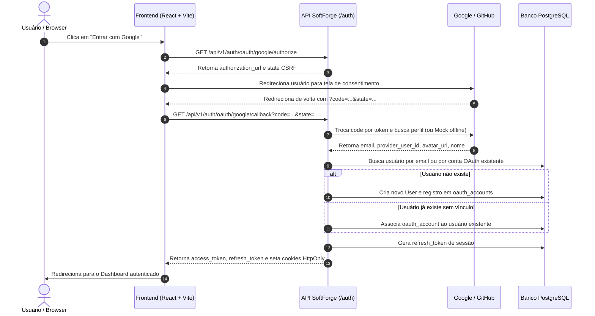

# Autenticação Social & OAuth2 (Google e GitHub)

> **Login seguro com um clique, vinculação automática de contas por e-mail e suporte a desenvolvimento 100% offline.**

---

## 1. Visão Geral da Arquitetura

O SoftForge implementa autenticação social via **OAuth2 Authorization Code Flow** com foco em privacidade, segurança e flexibilidade:

- **Provedores Nativos:** Suporte pré-configurado para **Google** e **GitHub**.
- **Vinculação Inteligente de Contas (Auto-Linking):** Se o usuário já se cadastrou previamente com e-mail e senha e depois clica em "Entrar com Google", o sistema associa com segurança a conta social ao mesmo usuário sem duplicar registros ou perder dados.
- **Tabela Dedicada `oauth_accounts`:** Suporta múltiplos provedores vinculados à mesma conta de usuário (`User`), com `provider_user_id` único por provedor.
- **Senhas Opcionais:** Usuários criados via provedor social possuem `hashed_password` nulo e podem posteriormente definir uma senha local caso queiram.
- **Segurança de Tokens:** Emissão de cookies `HttpOnly` com `SameSite=Lax` e `Secure`, além de tokens JWT no payload da resposta para compatibilidade com clientes móveis ou SPAs.
- **Mock Offline Transparente:** Em desenvolvimento local ou testes sem internet, códigos com prefixo `mock-` ou a ausência de chaves client secret ativam automaticamente o mock de perfil sem falhas de conexão.

---

## 2. Diagrama de Sequência do Fluxo OAuth2



---

## 3. Endpoints Disponíveis

### `GET /api/v1/auth/oauth/{provider}/authorize`
Gera a URL segura de autorização com estado CSRF criptográfico.

- **Parâmetros de Rota:** `provider` (`google` ou `github`).
- **Query Params:** `redirect_uri` (opcional, para redirecionamentos customizados).
- **Resposta:**
  ```json
  {
    "authorization_url": "https://accounts.google.com/o/oauth2/v2/auth?client_id=...&redirect_uri=...&state=...",
    "state": "random_secure_csrf_token_string",
    "provider": "google"
  }
  ```

---

### `GET /api/v1/auth/oauth/{provider}/callback`
Recebe o código de autorização após consentimento do usuário, valida o CSRF, troca por informações do perfil e emite a sessão.

- **Parâmetros de Rota:** `provider` (`google` ou `github`).
- **Query Params Obrigatórios:** `code`, `state`.
- **Resposta:**
  ```json
  {
    "access_token": "eyJhbGciOiJIUzI1NiIsInR5cCI6...",
    "refresh_token": "def456...",
    "token_type": "bearer",
    "user": {
      "id": "c1f7a08b-...",
      "email": "usuario@gmail.com",
      "full_name": "Usuário Google",
      "avatar_url": "https://lh3.googleusercontent.com/a/...",
      "is_active": true,
      "is_superuser": false,
      "created_at": "2026-10-06T07:00:00Z"
    },
    "is_new_user": true
  }
  ```

---

## 4. Configuração de Variáveis de Ambiente

No arquivo `apps/api/.env`:

```env
# URL base do Frontend para redirects pós-login
FRONTEND_URL=http://localhost:5173

# Google OAuth2 Credentials (Google Cloud Console)
GOOGLE_CLIENT_ID=seu_client_id_google.apps.googleusercontent.com
GOOGLE_CLIENT_SECRET=seu_client_secret_google

# GitHub OAuth App Credentials (GitHub Developer Settings)
GITHUB_CLIENT_ID=seu_github_client_id
GITHUB_CLIENT_SECRET=seu_github_client_secret
```

> **Dica para Desenvolvimento Offline:** Se nenhuma variável de OAuth for preenchida, o sistema entra automaticamente em modo Mock. Qualquer requisição com `code=mock-google-qualquercoisa` autentica com sucesso gerando perfis de teste de forma instantânea.
