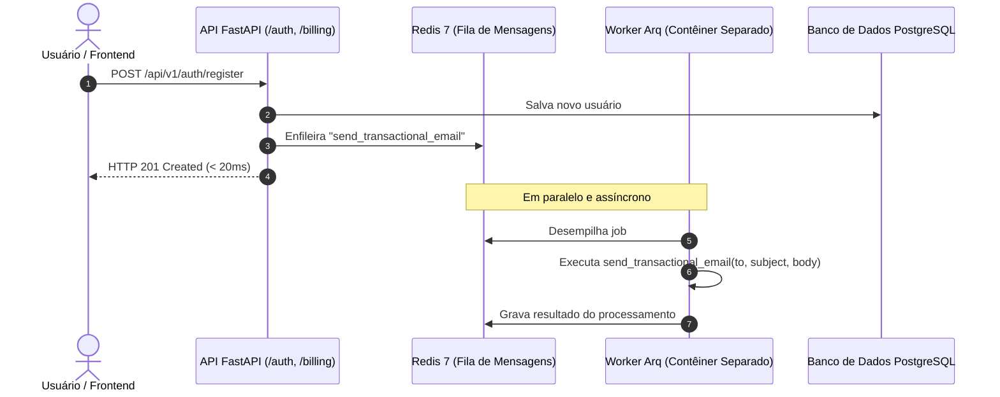

# Fila Assíncrona & Background Workers (Arq + Redis)

> **Processamento em segundo plano assíncrono nativo, agendamento de tarefas periódicas (cron) e suporte a execução 100% offline.**

---

## 1. Visão Geral da Arquitetura

O SoftForge adota o **Arq** como motor oficial de filas assíncronas e processamento em segundo plano:

- **100% Asyncio Nativo:** Projetado do zero para o loop de eventos assíncrono do Python (`async/await`). Interage diretamente e sem bloqueios com o SQLAlchemy 2.0 Async e clientes HTTP assíncronos (`httpx`).
- **Arquitetura Leve & Eficiente:** Broker sobre Redis 7, eliminando o consumo excessivo de memória e a complexidade de brokers pesados como Celery/RabbitMQ.
- **Isolamento de Contêineres:** Em ambiente de produção e Docker Compose, o serviço `worker` roda em seu próprio contêiner isolado da API web.
- **Desenvolvimento & Testes 100% Offline:** O framework inclui o `FakeQueueClient` em memória. Durante a execução de testes unitários (`pytest`), os jobs são enfileirados e inspecionados instantaneamente sem exigir Redis rodando ou conexão de rede.
- **Agendamento de Cron Embutido:** Permite registrar tarefas periódicas (ex: limpeza noturna de tokens revogados às 03:00 UTC) com sintaxe declarativa simples.

---

## 2. Diagrama de Fluxo de Fila



---

## 3. Tarefas Padrão Implementadas

As tarefas ficam centralizadas em `apps/api/src/core/queue/tasks.py`:

| Tarefa | Gatilho | Descrição |
| :--- | :--- | :--- |
| `send_transactional_email` | Evento (ex: registro, fatura) | Despacho assíncrono de e-mails de boas-vindas, recuperação de senha ou recibos. |
| `process_subscription_renewal` | Webhook / Fatura | Processa a renovação e ajuste de cotas de assinaturas corporativas ou individuais. |
| `cleanup_revoked_tokens` | Cron diário (03:00 UTC) | Expurga do banco de dados tokens de sessão JWT revogados ou com prazo expirado. |

---

## 4. Como Enfileirar Tarefas no seu Código

Em qualquer endpoint ou serviço do FastAPI, obtenha a fila através da dependência `get_queue`:

```python
from fastapi import APIRouter
from src.core.queue import get_queue

router = APIRouter()

@router.post("/convidar")
async def convidar_membro(email: str):
    queue = await get_queue()
    job_id = await queue.enqueue(
        "send_transactional_email",
        to_email=email,
        subject="Você foi convidado para o Workspace!",
        body_html="<p>Clique no link para aceitar seu convite.</p>",
    )
    return {"status": "enfileirado", "job_id": job_id}
```

---

## 5. Execução em Desenvolvimento e Produção

### Modo Docker Compose
No arquivo `docker-compose.yml`, os serviços sobem integrados com healthcheck:

```bash
# Sobe o banco PostgreSQL, o broker Redis e o worker de processamento
docker compose up -d
```

### Executando o Worker Localmente
```bash
cd apps/api
.\.venv\Scripts\activate
arq src.core.queue.worker.WorkerSettings
```

### Testes Offline com FakeQueue
Nos testes automatizados com `pytest`, a fila em memória é ativada automaticamente:

```python
from src.core.queue import get_fake_queue

def test_exemplo():
    fake_queue = get_fake_queue()
    # Verifica quantos jobs foram enfileirados
    assert fake_queue.enqueued_count == 1
    assert fake_queue.jobs[0]["function"] == "send_transactional_email"
```
