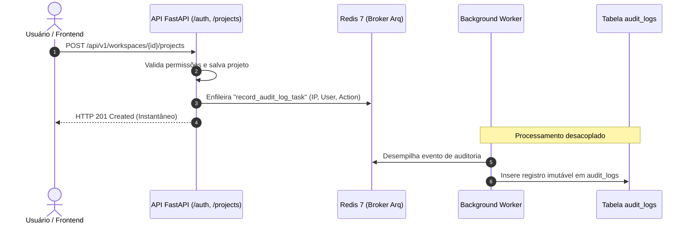

# Fatia Vertical: Auditoria & Compliance

> **Trilha de auditoria imutável, despacho assíncrono via Arq Worker com latência zero e conformidade com LGPD/GDPR.**

---

## 1. Visão Geral da Fatia

A fatia `audit` (`apps/api/src/slices/audit/`) implementa a rastreabilidade imutável de eventos operacionais, administrativos e de segurança no SoftForge:

- **Despacho Assíncrono com Latência Zero:** Ao ocorrer uma ação crítica (login, criação de projeto, alteração de permissão), o endpoint dispara um evento para a fila do Redis (`record_audit_log_task`). O processamento e gravação em banco ocorrem em segundo plano pelo Arq Worker, sem onerar o tempo de resposta da API (< 15ms).
- **Trilha Imutável (Append-Only):** A tabela `audit_logs` não possui mecanismo de atualização (`updated_at`), garantindo integridade e conformidade regulatória para fins periciais.
- **Rastreabilidade de Rede:** Captura automática do IP de origem (com suporte a proxies reversos via `X-Forwarded-For`) e User-Agent do cliente HTTP.
- **Preservação de Histórico de Usuário:** Armazena o snapshot do e-mail do autor (`user_email`), garantindo rastreabilidade histórica mesmo se a conta do usuário for posteriormente expurgada.
- **Controle de Acesso RBAC:** O endpoint de consulta é restrito a administradores e proprietários do Workspace (`min_role = WorkspaceRole.ADMIN`).

---

## 2. Diagrama do Ciclo de Auditoria



---

## 3. Endpoints Disponíveis

### `GET /api/v1/workspaces/{workspace_id}/audit-logs`
Consulta paginada da trilha de eventos do workspace.

- **Permissão Exigida:** `owner` ou `admin`.
- **Query Params:**
  - `action`: Filtro opcional por nome da ação (ex: `project.created`, `member.invited`).
  - `resource_type`: Filtro por tipo de entidade (ex: `project`, `workspace`).
  - `user_id`: Filtro por autor específico.
  - `page`: Número da página (padrão: `1`).
  - `page_size`: Quantidade por página (padrão: `20`, máx: `100`).
- **Resposta:**
  ```json
  {
    "items": [
      {
        "id": "b3f114c0-...",
        "workspace_id": "a1f102c0-...",
        "user_id": "c1f7a08b-...",
        "user_email": "admin@empresa.com",
        "action": "project.created",
        "resource_type": "project",
        "resource_id": "e9b210f1-...",
        "ip_address": "201.86.120.45",
        "user_agent": "Mozilla/5.0 ...",
        "created_at": "2026-10-06T07:45:00Z"
      }
    ],
    "total": 1,
    "page": 1,
    "page_size": 20
  }
  ```

---

## 4. Como Registrar Eventos de Auditoria

Em qualquer serviço ou endpoint do SoftForge, basta invocar a função `log_audit_event`:

```python
from src.slices.audit.service import log_audit_event

await log_audit_event(
    action="project.created",
    resource_type="project",
    resource_id=str(project.id),
    workspace_id=workspace_id,
    user_id=current_user.id,
    user_email=current_user.email,
    request=request,  # Extrai IP e User-Agent automaticamente
)
```
