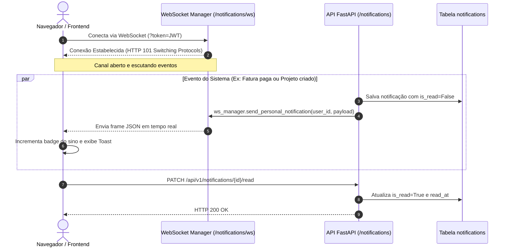

# Fatia Vertical: Notificações In-App & WebSockets

> **Centro de notificações em tempo real com canal Full-Duplex via WebSockets, badges dinâmicos e persistência relacional.**

---

## 1. Visão Geral da Fatia

A fatia `notifications` (`apps/api/src/slices/notifications/`) implementa o sistema de comunicação em tempo real e notificações internas da plataforma:

- **Canal WebSocket Full-Duplex:** Endpoint `/api/v1/notifications/ws?token=...` autenticado via JWT para entrega instantânea de notificações sem polling contínuo.
- **Gerenciador de Conexões Multitela:** `NotificationConnectionManager` mantém registro das conexões ativas por usuário, suportando múltiplos dispositivos e abas abertas simultaneamente para a mesma conta.
- **Protocolo de Liveness (Ping/Pong):** Manutenção ativa da integridade do canal com suporte a mensagens `{"type": "ping"}` e respostas `{"type": "pong"}` automáticas.
- **Histórico Persistido:** Todas as notificações são gravadas na tabela relacional `notifications`, permitindo que o usuário consulte notificações passadas e mantenha o badge de não lidas sincronizado mesmo após fechar a aba.
- **Operações em Lote:** Suporte a marcação de leitura individual (`PATCH /{id}/read`) e limpeza em massa (`POST /mark-all-read`).

---

## 2. Diagrama do Fluxo de Notificações em Tempo Real



---

## 3. Endpoints Disponíveis

### `GET /api/v1/notifications`
Lista paginada de notificações do usuário autenticado.

- **Query Params:**
  - `unread_only`: Filtra apenas as pendentes (`true`/`false`).
  - `page`: Número da página (padrão: `1`).
  - `page_size`: Quantidade por página (padrão: `20`, máx: `100`).

---

### `GET /api/v1/notifications/unread-count`
Retorna a contagem exata de notificações pendentes para renderizar o número sobre o ícone do sino na barra superior da UI.

- **Resposta:**
  ```json
  {
    "unread_count": 3
  }
  ```

---

### `PATCH /api/v1/notifications/{notification_id}/read`
Marca uma notificação individual como lida.

---

### `POST /api/v1/notifications/mark-all-read`
Marca todas as notificações não lidas do usuário como lidas em uma única transação atômica.

---

### `WebSocket /api/v1/notifications/ws`
Canal persistente para streaming de eventos de notificação.

- **Autenticação:** Query param `?token=<access_token>`.
- **Payload Recebido pelo Cliente:**
  ```json
  {
    "event": "notification.received",
    "notification": {
      "id": "c1f7a08b-...",
      "user_id": "...",
      "title": "Novo membro adicionado",
      "message": "Carlos ingressou no workspace.",
      "category": "team",
      "action_url": "/workspaces/me/members",
      "is_read": false,
      "created_at": "2026-10-06T07:50:00Z"
    }
  }
  ```

---

## 4. Como Disparar Notificações no Backend

Em qualquer serviço do SoftForge, utilize a função `create_and_send_notification`:

```python
from src.slices.notifications.service import create_and_send_notification

await create_and_send_notification(
    session=session,
    user_id=target_user_id,
    title="Projeto Finalizado",
    message="O pipeline de CI aprovou todos os testes.",
    category="project",
    action_url=f"/workspaces/{workspace_id}/projects/{project_id}",
)
```
O método cuida automaticamente da gravação no banco de dados e do envio imediato para todas as conexões WebSocket abertas daquele usuário.
