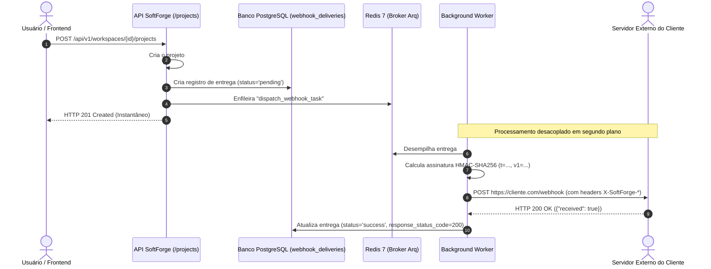

# Fatia Vertical: Webhooks Outbound

> **Despacho desacoplado de eventos via Arq Worker, assinatura criptográfica HMAC-SHA256 e rastreabilidade pericial de entregas.**

---

## 1. Visão Geral da Fatia

A fatia `webhooks` (`apps/api/src/slices/webhooks/`) implementa o motor de integração outbound para terceiros do SoftForge:

- **Despacho Desacoplado via Arq Worker:** Ao ocorrer um evento no workspace (ex: criação de projeto, novo membro, fatura paga), a API grava a entrega com status `pending` e delega o disparo HTTP para o Worker em segundo plano, mantendo a resposta da API instantânea (< 15ms).
- **Assinatura Criptográfica HMAC-SHA256:** Cada endpoint possui um segredo exclusivo (`whsec_...`). Todas as requisições HTTP enviadas acompanham o cabeçalho `X-SoftForge-Signature: t={timestamp},v1={hex_digest}` para que o receptor valide a integridade e se proteja contra ataques de repetição (*replay attacks*).
- **Inscrição Granular de Eventos:** Endpoints podem se inscrever em tópicos específicos (ex: `["project.created", "member.invited"]`) ou em todos os eventos usando o curinga `["*"]`.
- **Rastreabilidade Pericial:** A tabela `webhook_deliveries` registra detalhadamente o código HTTP retornado, primeiros 1000 caracteres do corpo da resposta, tempo de entrega, contador de tentativas e mensagens de erro de timeout ou conexão.
- **Desenvolvimento & Testes Offline:** URLs iniciando com `mock://` são resolvidas diretamente pelo Worker em milissegundos sem dependência de rede externa.

---

## 2. Diagrama de Sequência de Despacho de Webhook



---

## 3. Formato do Cabeçalho de Assinatura

O receptor do webhook deve validar o cabeçalho `X-SoftForge-Signature`:

```http
POST /seus-webhooks HTTP/1.1
Host: sua-empresa.com
Content-Type: application/json
User-Agent: SoftForge-Webhooks/1.0
X-SoftForge-Event: project.created
X-SoftForge-Delivery: 9b1deb4d-3b7d-4bad-9bdd-2b0d7b3dcb6d
X-SoftForge-Signature: t=1728211200,v1=a1b2c3d4e5f6...
```

### Como Validar a Assinatura no seu Receptor (Python)

```python
import hmac, hashlib, json

def validar_webhook(secret: str, payload_dict: dict, header: str) -> bool:
    parts = dict(p.split("=") for p in header.split(","))
    timestamp = parts["t"]
    expected_v1 = parts["v1"]

    payload_str = json.dumps(payload_dict, sort_keys=True, separators=(",", ":"))
    signed_payload = f"{timestamp}.{payload_str}".encode("utf-8")
    computed_v1 = hmac.new(secret.encode("utf-8"), signed_payload, hashlib.sha256).hexdigest()

    return hmac.compare_digest(computed_v1, expected_v1)
```

---

## 4. Endpoints Disponíveis

Todos os endpoints exigem papel mínimo de Administrador (`WorkspaceRole.ADMIN`):

| Método | Rota | Descrição |
| :--- | :--- | :--- |
| `POST` | `/api/v1/workspaces/{id}/webhooks` | Cadastra novo webhook e gera o segredo `whsec_...` |
| `GET` | `/api/v1/workspaces/{id}/webhooks` | Lista todos os webhooks do workspace |
| `GET` | `/api/v1/workspaces/{id}/webhooks/{endpoint_id}` | Obtém detalhes e segredo do webhook |
| `PATCH` | `/api/v1/workspaces/{id}/webhooks/{endpoint_id}` | Atualiza URL, eventos inscritos ou status de ativação |
| `DELETE` | `/api/v1/workspaces/{id}/webhooks/{endpoint_id}` | Exclui endpoint e histórico associado |
| `GET` | `/api/v1/workspaces/{id}/webhooks/{endpoint_id}/deliveries` | Consulta o histórico paginado de entregas e status HTTP |
