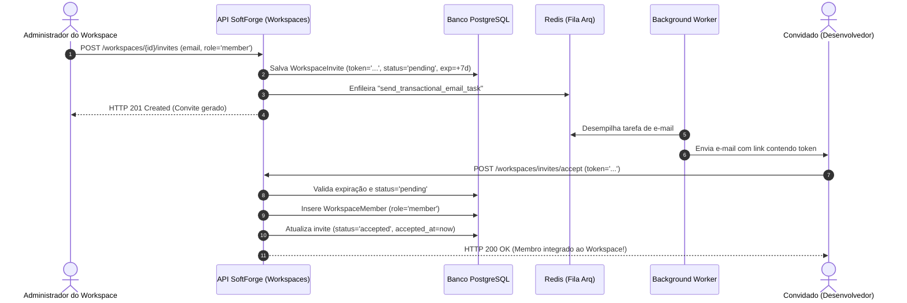

# Fatia: Convites de Equipe & Gestão de Membros (RBAC)

> **Colaboração multi-usuário com convites por e-mail, tokens seguros com validade de 7 dias, controle hierárquico de cargos e proteção contra remoção de proprietário.**

---

## 1. Visão Geral da Fatia

A expansão de gestão de equipes na fatia `workspaces` (`apps/api/src/slices/workspaces/`) implementa o ciclo de vida completo de colaboração do SoftForge:

- **Convites Seguros por Token:** Administradores convidam novos colaboradores informando o e-mail corporativo e o papel inicial (Admin, Member, Viewer). Um token seguro de 32 bytes (`secrets.token_urlsafe(32)`) com validade padrão de 7 dias é gerado.
- **Despacho Assíncrono de E-mail via Arq Worker:** O envio do e-mail com o link de ativação (`/invites/accept?token=...`) é enfileirado no Redis e processado em segundo plano com latência zero para a API.
- **Aceitação Transparente:** O colaborador autenticado aceita o convite via endpoint `/api/v1/workspaces/invites/accept`, sendo automaticamente inserido como membro ativo do workspace.
- **Hierarquia RBAC Rigorosa:**
  - `Owner (4)`: Controle total, gestão de cobrança, transferência de posse e exclusão do workspace.
  - `Admin (3)`: Emissão e revogação de convites, alteração de cargos de membros, gestão de integrações (webhooks e API keys).
  - `Member (2)`: Leitura e escrita em recursos de negócio (projetos, tarefas).
  - `Viewer (1)`: Acesso exclusivamente de leitura.
- **Proteções de Integridade do Workspace:**
  - O proprietário (`Owner`) **nunca pode ser removido** do workspace nem ter seu papel rebaixado por outro membro.
  - A transferência do papel de `Owner` só pode ser realizada pelo próprio `Owner` atual.
  - Tentativas de convidar um e-mail que já é membro ativo são rejeitadas com HTTP 400 Bad Request.
  - Convites pendentes para o mesmo e-mail são renovados com novo token e prazo reiniciado.
- **Rastreabilidade Pericial:** Ações de convite, aceitação, alteração de cargo e remoção disparam eventos auditados (`invite.created`, `invite.accepted`, `member.role_updated`, `member.removed`) e webhooks outbound em tempo real.

---

## 2. Diagrama de Fluxo de Convite e Adesão



---

## 3. Endpoints da Fatia

| Método | Rota | Descrição | Permissão Mínima |
| :--- | :--- | :--- | :--- |
| `POST` | `/api/v1/workspaces/{workspace_id}/invites` | Emite convite de equipe por e-mail com token de 7 dias | `Admin` |
| `GET` | `/api/v1/workspaces/{workspace_id}/invites` | Lista todos os convites pendentes do workspace | `Admin` |
| `DELETE` | `/api/v1/workspaces/{workspace_id}/invites/{invite_id}` | Revoga imediatamente um convite pendente | `Admin` |
| `POST` | `/api/v1/workspaces/invites/accept` | Aceita um convite de equipe via token criptográfico | `Autenticado` |
| `GET` | `/api/v1/workspaces/{workspace_id}/members` | Lista todos os membros atuais do workspace | `Viewer` |
| `PATCH` | `/api/v1/workspaces/{workspace_id}/members/{user_id}` | Altera o cargo RBAC de um membro | `Admin` |
| `DELETE` | `/api/v1/workspaces/{workspace_id}/members/{user_id}` | Remove um membro do workspace | `Admin` |

---

## 4. Exemplo de Resposta de Convite

```json
{
  "id": "e932b144-8df6-4e56-9a57-e6eb20199988",
  "workspace_id": "7ca64c12-3211-419b-a0d3-5b8719bc16da",
  "invited_by_user_id": "1ea29b33-4182-411a-82dc-3b4908ef1234",
  "email": "dev@empresa.com",
  "role": "member",
  "status": "pending",
  "token": "d7kF9pLm2nBv8xY0zA4cD6fH1jK3mO5q",
  "expires_at": "2026-10-13T12:00:00Z",
  "accepted_at": null,
  "created_at": "2026-10-06T12:00:00Z"
}
```

---

## 5. Validação Automática & Testes

A suíte de testes determinísticos cobre:
1. **Emissão e Token:** Geração de token único de 32 bytes e definição precisa da validade de 7 dias.
2. **Prevenção de Duplicidade:** Bloqueio imediato (HTTP 400) ao tentar convidar alguém que já é membro ativo.
3. **Aceitação e Integração:** Ativação instantânea da filiação ao workspace com o cargo correto.
4. **Proteção Contra Revogados/Expirados:** Tentativa de aceitar convites revogados ou vencidos retorna erro adequado (404/400).
5. **Governança RBAC:** Garantia de que o `Owner` não pode ser expulso nem rebaixado arbitrariamente.
