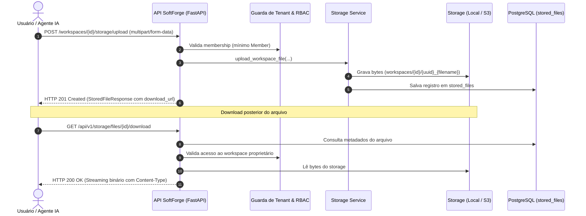

# Fatia: Storage & Gerenciamento de Arquivos

> **Armazenamento de anexos, documentos e avatares com suporte híbrido: sistema local em dev/testes offline e compatibilidade S3/MinIO para produção.**

---

## 1. Visão Geral da Fatia

A fatia `storage` (`apps/api/src/slices/storage/`) implementa o subsistema unificado de persistência binária do SoftForge:

- **Arquitetura Agnóstica de Provedor:** Abstrai o armazenamento físico através de uma interface padronizada, permitindo operar localmente no disco (`uploads/`) durante o desenvolvimento offline e no AWS S3, Cloudflare R2 ou MinIO em ambientes conteinerizados e produção.
- **Desenvolvimento 100% Offline:** Em modo de desenvolvimento e na execução da suíte `pytest`, grava e recupera arquivos no sistema de arquivos local sem qualquer dependência de rede ou credenciais em nuvem.
- **Isolamento Multi-Tenant por Workspace:** Arquivos anexados a um workspace são protegidos pela camada RBAC. Um membro de outro workspace recebe HTTP 403 Forbidden ao tentar baixar ou excluir arquivos privados.
- **Arquivos Públicos vs. Privados:** Suporte nativo a arquivos públicos (ex: fotos de perfil e avatares de usuários em `/storage/files/{id}/download`), dispensando cabeçalhos de autenticação para renderização rápida em navegadores.
- **Upload Multipart & Limites de Tamanho:** Endpoints configurados com controle declarativo de quota e tamanho máximo (`MAX_UPLOAD_SIZE_MB`), rejeitando cargas excessivas com HTTP 413 Payload Too Large.
- **Sanitização de Nomes & Rastreabilidade:** Nomes originais de arquivos passam por higienização regex contra *path traversal* (`../`) e caracteres inseguros. Cada operação emite auditoria e webhooks outbound (`file.uploaded`, `file.deleted`).

---

## 2. Diagrama de Fluxo de Upload e Download



---

## 3. Endpoints da Fatia

| Método | Rota | Descrição | Permissão Mínima |
| :--- | :--- | :--- | :--- |
| `POST` | `/api/v1/workspaces/{workspace_id}/storage/upload` | Faz upload de arquivo para o workspace | `Member` |
| `GET` | `/api/v1/workspaces/{workspace_id}/storage/files` | Lista arquivos anexados ao workspace | `Viewer` |
| `DELETE` | `/api/v1/workspaces/{workspace_id}/storage/files/{file_id}` | Exclui arquivo físico e remove registro | `Member` |
| `GET` | `/api/v1/storage/files/{file_id}/download` | Faz download/streaming do arquivo | `Público / Autenticado` |
| `POST` | `/api/v1/users/me/avatar` | Atualiza a foto de perfil do usuário logado | `Autenticado` |

---

## 4. Configuração no `.env`

```env
# Backend de armazenamento (local | s3 | minio)
STORAGE_BACKEND=local
STORAGE_LOCAL_DIR=uploads
MAX_UPLOAD_SIZE_MB=25

# Credenciais S3 / MinIO (para staging e produção)
S3_BUCKET_NAME=softforge-uploads
S3_REGION=us-east-1
S3_ENDPOINT_URL=http://minio:9000
S3_ACCESS_KEY_ID=minioadmin
S3_SECRET_ACCESS_KEY=minioadmin
```

---

## 5. Validação Automática & Testes

A fatia conta com 100% de cobertura nos testes do Pytest (`test_storage_slice.py`):
1. **Upload e Integridade de Bytes:** Envio multipart, verificação de metadados no banco e integridade exata dos bytes gravados.
2. **Streaming e Headers HTTP:** Validação do cabeçalho `Content-Type` e `Content-Disposition`.
3. **Isolamento de Tenant:** Bloqueio com HTTP 403 Forbidden para tentativas de download cruzado entre workspaces distintos.
4. **Avatares Públicos:** Upload de avatar atualizando `avatar_url` no perfil `/auth/me` com acesso público sem cabeçalho de autenticação.
