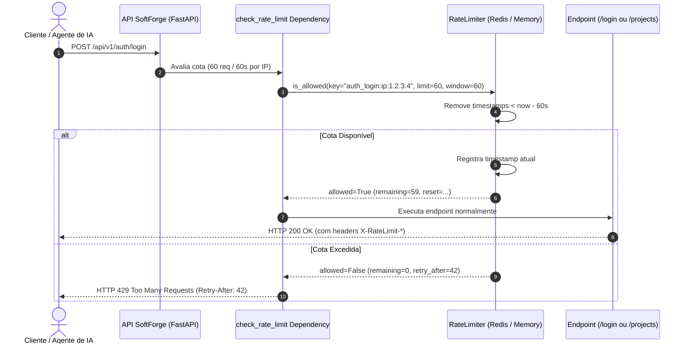

# Motor de Rate Limiting & Proteção Contra Abuso

> **Mitigação de ataques de força bruta, prevenção de loops infinitos de agentes autônomos e controle de vazão com Sliding Window baseado em Redis e Fallback em Memória.**

---

## 1. Visão Geral da Arquitetura

O módulo de Rate Limiting (`apps/api/src/core/ratelimit/`) implementa o escudo de proteção perimetral e controle de vazão da API do SoftForge:

- **Algoritmo de Janela Deslizante (Sliding Window):** Ao contrário de contadores fixos que permitem picos no final da janela (*bursting exploit*), o algoritmo de janela deslizante avalia a taxa contínua de requisições por segundo/minuto com precisão milimétrica.
- **Motor Híbrido Redis + Memória (Zero Downtime / Zero Dependencies):**
  - **Redis em Produção:** Utiliza Sorted Sets atômicos (`ZSET`) via pipeline, garantindo contagem sincronizada entre múltiplos contêineres e réplicas da API.
  - **MemoryRateLimiter em Testes/Dev:** Implementado sobre `collections.deque` de alta performance (< 0.2ms), viabilizando execução 100% offline da suíte `pytest` sem dependência de serviços externos.
  - **Graceful Fallback:** Caso o cluster Redis fique temporariamente inacessível, o sistema ativa o limitador em memória automaticamente sem derrubar requisições de clientes legítimos.
- **Identificação Granular:** Suporta regras baseadas em:
  - `ip`: IP real do cliente (com resolução de proxies reversos e cabeçalhos `X-Forwarded-For`).
  - `api_key`: Identificador de Chave de API / PAT para tráfego Machine-to-Machine.
  - `user`: Identificador do usuário autenticado no workspace.
  - `auto`: Prioriza chave de API > usuário autenticado > IP do cliente.
- **Cabeçalhos Padrão RFC:** Toda requisição monitorada recebe no cabeçalho HTTP:
  - `X-RateLimit-Limit`: Cota máxima na janela configurada.
  - `X-RateLimit-Remaining`: Requisições restantes antes do bloqueio.
  - `X-RateLimit-Reset`: Timestamp Unix para restauração total da cota.
- **Tratamento de Excesso (HTTP 429 Too Many Requests):** Requisições que ultrapassarem a cota recebem status HTTP 429 com o cabeçalho `Retry-After: {segundos}` e carga JSON padronizada com código de erro `RATE_LIMIT_EXCEEDED`.

---

## 2. Diagrama de Sequência de Rate Limiting



---

## 3. Como Utilizar em Endpoints

Basta injetar a dependência declarativa `check_rate_limit`:

```python
from fastapi import APIRouter, Depends
from src.core.ratelimit import check_rate_limit

router = APIRouter()

@router.post(
    "/endpoint-critico",
    dependencies=[
        Depends(check_rate_limit(requests=10, window_seconds=60, by="ip", action="critico"))
    ],
)
async def meu_endpoint():
    return {"status": "ok"}
```

---

## 4. Endpoint de Consulta de Cota

Clientes e agentes autônomos de IA podem consultar seu status e IP detectado através do endpoint de sistema:

```http
GET /api/v1/system/rate-limit HTTP/1.1
Host: api.softforge.redepronta.com
Authorization: Bearer sf_live_...
```

**Resposta:**
```json
{
  "status": "active",
  "client_ip": "177.136.241.10",
  "limit": 60,
  "remaining": 59,
  "reset_time": 1728211260
}
```

---

## 5. Validação Automática & Testes

A suíte de testes determinísticos cobre:
1. **Mecânica de Janela Deslizante:** Verificação de contagem, decréscimo de saldo e bloqueio na N+1ª requisição com cálculo exato de `retry_after`.
2. **Injeção de Cabeçalhos HTTP:** Validação de `X-RateLimit-Limit`, `X-RateLimit-Remaining` e `X-RateLimit-Reset`.
3. **Bloqueio com HTTP 429:** Simulação de saturação da cota com retorno do cabeçalho `Retry-After` e formato JSON estruturado.
