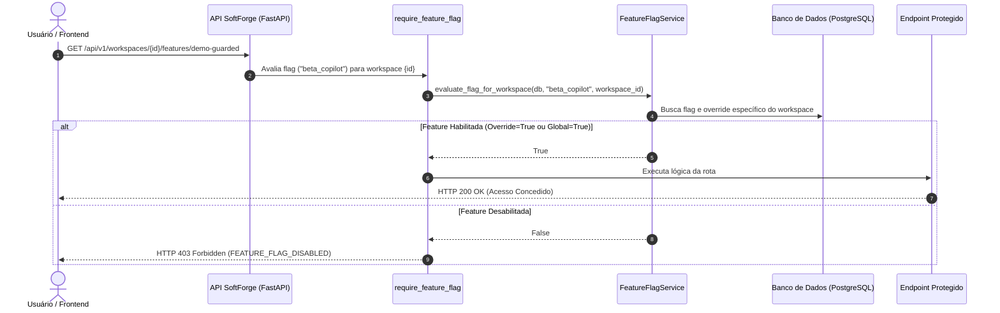

# Fatia: Feature Flags & Toggles de Tenant

> **Lançamento progressivo de recursos, ativação dinâmica de funcionalidades beta e customização granular por Workspace com fallback hierárquico.**

---

## 1. Visão Geral da Arquitetura

A fatia de **Feature Flags & Toggles de Tenant** (`apps/api/src/slices/feature_flags/`) fornece ao SoftForge a capacidade de habilitar, desabilitar ou testar funcionalidades sem a necessidade de novos deploys ou alterações no banco de dados em produção:

- **Catálogo Global de Flags (`feature_flags`):** Cadastro mestre de funcionalidades do sistema com identificadores padronizados em formato slug (ex: `beta_copilot`, `export_pdf`, `dark_mode_v2`).
- **Hierarquia de Avaliação (Override > Global):**
  - **Padrão Global (`is_enabled`):** Define se a feature está ativa para todos os usuários por padrão.
  - **Substituição por Workspace (`feature_flag_overrides`):** Permite ligar ou desligar uma flag exclusivamente para um cliente ou workspace específico (ex: clientes VIP, opt-in de beta testers ou bloqueio por inadimplência).
- **Consolidação em Requisição Única (`GET /workspaces/{id}/features`):** Retorna um mapa chave-valor (`{ "beta_copilot": true, "export_pdf": false }`) pronto para bootstrapping e consumo no frontend via React hooks ou Context API.
- **Proteção Declarativa em Endpoints (`require_feature_flag`):** Dependência FastAPI que intercepta requisições e retorna `HTTP 403 Forbidden` com código de erro `FEATURE_FLAG_DISABLED` caso a funcionalidade esteja inativa para o workspace solicitante.
- **Trilha de Auditoria Transparente:** Toda criação, alteração ou remoção de flag e override é enfileirada no `audit_logs` via Arq Worker.

---

## 2. Diagrama de Sequência de Avaliação e Bloqueio



---

## 3. Endpoints da API

### Gestão Global de Sistema

| Método | Endpoint | Papel Mínimo | Descrição |
| :--- | :--- | :--- | :--- |
| `GET` | `/api/v1/system/features` | Autenticado | Lista todas as flags cadastradas no catálogo global. |
| `POST` | `/api/v1/system/features` | Autenticado | Cadastra nova feature flag com status padrão inicial. |
| `GET` | `/api/v1/system/features/{id}` | Autenticado | Obtém detalhes e metadados de uma flag por UUID. |
| `PATCH` | `/api/v1/system/features/{id}` | Autenticado | Altera nome, descrição ou estado global ativo/inativo. |
| `DELETE`| `/api/v1/system/features/{id}` | Autenticado | Remove permanentemente a flag e todos os seus overrides associados. |

### Avaliação e Overrides por Workspace (Tenant)

| Método | Endpoint | Papel Mínimo | Descrição |
| :--- | :--- | :--- | :--- |
| `GET` | `/api/v1/workspaces/{id}/features` | Viewer | Retorna o dicionário de flags avaliadas para o workspace atual. |
| `POST` | `/api/v1/workspaces/{id}/features/{flag_id}/override` | Admin | Força a ativação (`true`) ou desativação (`false`) da flag no tenant. |
| `DELETE`| `/api/v1/workspaces/{id}/features/{flag_id}/override` | Admin | Exclui a substituição local, restaurando o comportamento global. |
| `GET` | `/api/v1/workspaces/{id}/features/demo-guarded` | Viewer | Endpoint modelo protegido pela dependência `require_feature_flag`. |

---

## 4. Como Proteger Endpoints no Backend

Para restringir o acesso a qualquer rota com base em uma Feature Flag:

```python
from fastapi import APIRouter, Depends
from src.slices.feature_flags.dependencies import require_feature_flag

router = APIRouter()

@router.post(
    "/workspaces/{workspace_id}/ai-copilot",
    dependencies=[Depends(require_feature_flag("ai_copilot"))],
    summary="Executar inferência com IA Copilot",
)
async def run_ai_copilot(workspace_id: uuid.UUID) -> dict[str, str]:
    return {"status": "ok", "result": "Resposta gerada pela IA"}
```

Caso o workspace não tenha a flag ativa, a API responderá instantaneamente:

```json
{
  "error": "FEATURE_FLAG_DISABLED",
  "message": "A funcionalidade 'ai_copilot' está desabilitada para este workspace.",
  "details": {
    "flag_key": "ai_copilot"
  },
  "request_id": "c7a84e31-89d1-4ad9-a764-16297eb098bc"
}
```

---

## 5. Como Consumir no Frontend

Ao trocar de workspace ou carregar o dashboard, consuma o endpoint de avaliação tipado:

```typescript
import { useEvaluateWorkspaceFeatures } from "@/api/generated/featureFlagsToggles";

export function DashboardBanner({ workspaceId }: { workspaceId: string }) {
  const { data } = useEvaluateWorkspaceFeatures(workspaceId);

  if (!data?.flags?.["beta_dashboard"]) {
    return null; // Oculta visualmente se a flag estiver inativa
  }

  return <div className="p-4 bg-primary/10 rounded-lg">🚀 Bem-vindo ao Beta!</div>;
}
```
