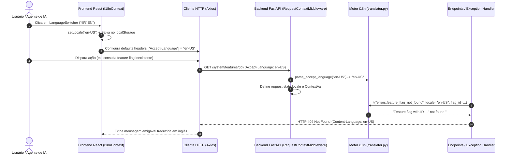

# Internacionalização (i18n) & Localização Global

> **Suporte bilíngue nativo (Português do Brasil `pt-BR` e Inglês `en-US`), negociação automática de conteúdo via RFC 7231 (`Accept-Language` / `Content-Language`) e sincronização reativa entre React e FastAPI.**

---

## 1. Visão Geral da Arquitetura

O sistema de Internacionalização do **SoftForge** foi concebido para entregar uma experiência global sem atritos, tanto para usuários finais navegando no frontend quanto para agentes de IA e clientes externos consumindo a API:

- **Negociação de Conteúdo Padronizada (RFC 7231):**
  - O cliente informa sua preferência linguística no cabeçalho HTTP `Accept-Language` (ex: `en-US,en;q=0.9,pt-BR;q=0.8`).
  - O middleware do backend (`RequestContextMiddleware`) analisa os fatores de qualidade (*q-factors*), identifica o idioma mais adequado (`pt-BR` ou `en-US`) e injeta no contexto assíncrono da requisição (`ContextVar`).
  - Todas as respostas HTTP do backend emitem o cabeçalho padronizado `Content-Language: {locale}`.
- **Tradução Dinâmica de Erros (`AppException`):**
  - Erros de validação (HTTP 422), erros de autenticação (HTTP 401), permissões negadas (HTTP 403), recursos não encontrados (HTTP 404), limites de taxa (HTTP 429) e mensagens de domínio são automaticamente traduzidos para o idioma do solicitante.
- **Frontend Tipado com Zero Overhead (`I18nProvider`):**
  - Dicionários TypeScript (`pt-BR.ts` e `en-US.ts`) com verificação estrita em tempo de compilação: qualquer chave faltante ou tipo incompatível gera erro estático no build.
  - Hook reativo `useI18n()` fornecendo `locale`, `setLocale(locale)` e função interpoladora `t(key, params)`.
  - Persistência automática no `localStorage` e detecção inicial via idioma do navegador (`navigator.language`).
  - Interceptor Axios sincronizado: ao alternar de idioma no frontend, todas as requisições HTTP subsequentes enviam automaticamente `Accept-Language: {locale}` para o backend.
- **Componente Seletor de Idioma (`LanguageSwitcher`):**
  - Widget compacto e acessível posicionado na interface permitindo alternar instantaneamente entre 🇧🇷 PT e 🇺🇸 EN com um clique.

---

## 2. Diagrama de Sequência de Internacionalização



---

## 3. Endpoints de Diagnóstico e Sistema

| Método | Endpoint | Cabeçalho Recomendado | Descrição |
| :--- | :--- | :--- | :--- |
| `GET` | `/api/v1/system/i18n` | `Accept-Language: en-US` | Retorna o idioma detectado da requisição, idiomas suportados pelo framework e total de traduções disponíveis. |

### Exemplo de Resposta (`GET /api/v1/system/i18n` com `Accept-Language: en-US`):

```json
{
  "current_locale": "en-US",
  "default_locale": "pt-BR",
  "supported_locales": [
    "pt-BR",
    "en-US"
  ],
  "welcome_message": "Welcome to SoftForge — AI-Native Fullstack Framework.",
  "translations_count": 16
}
```

---

## 4. Como Utilizar no Backend (FastAPI)

### 4.1 Tradução de Mensagens em Serviços

```python
from src.core.i18n import t

# Tradução automática considerando o idioma da requisição ativa:
msg = t("errors.rate_limit_exceeded", retry_after=30)
# Resultado em pt-BR: "Limite de requisições excedido. Tente novamente em 30s."
# Resultado em en-US: "Rate limit exceeded. Please try again in 30s."
```

### 4.2 Lançamento de Exceções com Chaves Traduzidas

```python
from src.core.errors import NotFoundException

# O handler HTTP traduzirá a mensagem automaticamente com base no Accept-Language do cliente:
raise NotFoundException(
    message=f"Workspace com ID '{workspace_id}' não encontrado",
    message_key="errors.workspace_not_found",
    message_kwargs={"workspace_id": str(workspace_id)},
)
```

---

## 5. Como Utilizar no Frontend (React)

### 5.1 Consumindo o Hook `useI18n`

```tsx
import { useI18n } from "@/core/i18n";

export function HeaderTitle() {
  const { t } = useI18n();

  return (
    <div>
      <h1>{t("nav.dashboard")}</h1>
      <p>{t("system.welcome")}</p>
    </div>
  );
}
```

### 5.2 Inserindo o Seletor de Idioma

```tsx
import { LanguageSwitcher } from "@/core/i18n";

export function TopBar() {
  return (
    <div className="flex justify-between items-center p-4">
      <span>SoftForge App</span>
      <LanguageSwitcher variant="button" />
    </div>
  );
}
```
