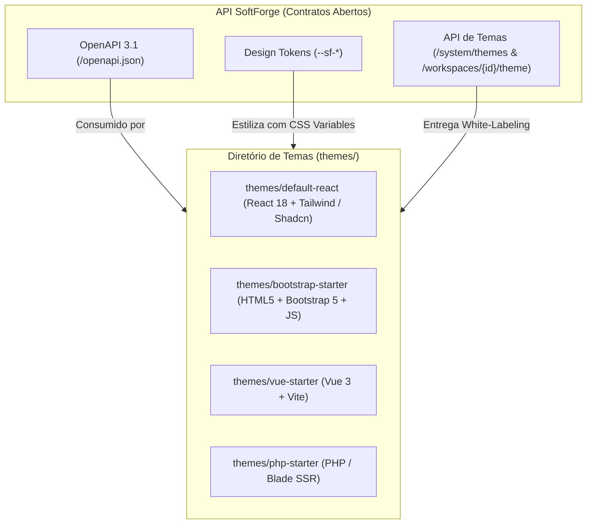

# Sistema de Temas & Multi-Frontends Agnósticos

> **Arquitetura aberta e desacoplada que permite conectar interfaces em React, Vue, Bootstrap 5 / HTML clássico, Blade/PHP ou HTMX sobre a mesma API e contratos do SoftForge.**

---

## 1. Visão Geral da Arquitetura

O SoftForge não impõe uma única tecnologia de interface. Ele foi concebido para que clientes, desenvolvedores e **agentes autônomos de IA** possam utilizar ou gerar qualquer biblioteca ou framework visual:



### Princípios de Design
1. **Contratos OpenAPI 3.1 como Ponte:** Todo frontend (seja uma SPA em React ou uma aplicação em PHP) consome os mesmos endpoints autenticados (JWT em cookies ou header `Authorization: Bearer`).
2. **Design Tokens Universais (`--sf-*`):** Cores, raios de borda e tipografia são expostos como variáveis CSS nativas que mapeiam naturalmente para Tailwind (`bg-primary`), Bootstrap 5 (`--bs-primary`), CSS puro ou variáveis de templates.
3. **Manifesto do Tema (`softforge-theme.json`):** Arquivo padrão que descreve o motor (`engine`), metadados e tokens do tema.
4. **White-Labeling por Workspace:** Cada cliente pode ter sua identidade visual (logo, cor primária e CSS customizado) aplicada em tempo real.

---

## 2. O Manifesto do Tema (`softforge-theme.json`)

Todo tema localizado no diretório raiz `themes/{nome-do-tema}/` contém um manifesto declarativo:

```json
{
  "$schema": "./theme-schema.json",
  "name": "SoftForge Bootstrap Admin",
  "slug": "bootstrap-starter",
  "version": "1.0.0",
  "engine": "html-bootstrap",
  "author": "SoftForge Team",
  "description": "Tema clássico de alta compatibilidade construído sobre Bootstrap 5 e Vanilla JS.",
  "tokens": {
    "colors": {
      "primary": "#4f46e5",
      "primary_foreground": "#ffffff",
      "background": "#ffffff",
      "foreground": "#0f172a",
      "card": "#f8fafc",
      "border": "#e2e8f0",
      "muted": "#64748b"
    },
    "typography": {
      "font_family": "system-ui, -apple-system, sans-serif"
    },
    "geometry": {
      "border_radius": "0.5rem"
    }
  }
}
```

---

## 3. Mapeamento de Design Tokens Universais

O SoftForge injeta os tokens no elemento raiz (`:root`) do HTML, permitindo reutilização imediata:

| Token Universal | CSS Variable | Mapeamento Tailwind | Mapeamento Bootstrap 5 |
| :--- | :--- | :--- | :--- |
| Cor Primária | `--sf-color-primary` | `bg-primary` / `text-primary` | `--bs-primary` / `.btn-primary` |
| Fundo Geral | `--sf-color-bg` | `bg-background` | `--bs-body-bg` / `bg-body` |
| Cor do Texto | `--sf-color-text` | `text-foreground` | `--bs-body-color` / `text-body` |
| Superfície / Card | `--sf-color-card` | `bg-card` | `.card` / `bg-light` |
| Borda | `--sf-color-border` | `border-border` | `--bs-border-color` |
| Raio de Borda | `--sf-radius` | `rounded-lg` | `--bs-border-radius` |

---

## 4. Como Criar um Novo Tema (Passo a Passo)

### Exemplo: Tema em HTML5 + Bootstrap 5
1. Crie a pasta em `themes/meu-tema-bootstrap/`.
2. Adicione o arquivo `softforge-theme.json` com `engine: "html-bootstrap"`.
3. Crie `index.html` importando o CSS do Bootstrap e as variáveis `--sf-*`:

```html
<!DOCTYPE html>
<html lang="pt-BR">
<head>
  <meta charset="UTF-8">
  <title>Dashboard SoftForge</title>
  <link rel="stylesheet" href="https://cdn.jsdelivr.net/npm/bootstrap@5.3.3/dist/css/bootstrap.min.css">
  <style>
    :root {
      --bs-primary: var(--sf-color-primary, #4f46e5);
      --bs-border-radius: var(--sf-radius, 0.5rem);
    }
  </style>
</head>
<body class="bg-light">
  <div class="container py-5">
    <h1 class="h3 mb-4">Painel SoftForge (Bootstrap 5)</h1>
    <div id="projects-container" class="row g-3">
      <!-- Carregado via fetch('/api/v1/projects') -->
    </div>
  </div>
  <script>
    fetch('/api/v1/projects', { credentials: 'include' })
      .then(res => res.json())
      .then(data => console.log('Projetos carregados:', data));
  </script>
</body>
</html>
```

---

## 5. Endpoints de White-Labeling e Temas no Backend

| Método | Endpoint | Papel Mínimo | Descrição |
| :--- | :--- | :--- | :--- |
| `GET` | `/api/v1/system/themes` | Público / Autenticado | Lista todos os temas e engines instalados no diretório `themes/`. |
| `GET` | `/api/v1/workspaces/{id}/theme` | Viewer | Retorna as variáveis de tema e branding consolidadas do workspace. |
| `PATCH`| `/api/v1/workspaces/{id}/theme` | Admin | Altera logo customizada, cor primária, tema ativo ou CSS customizado. |
