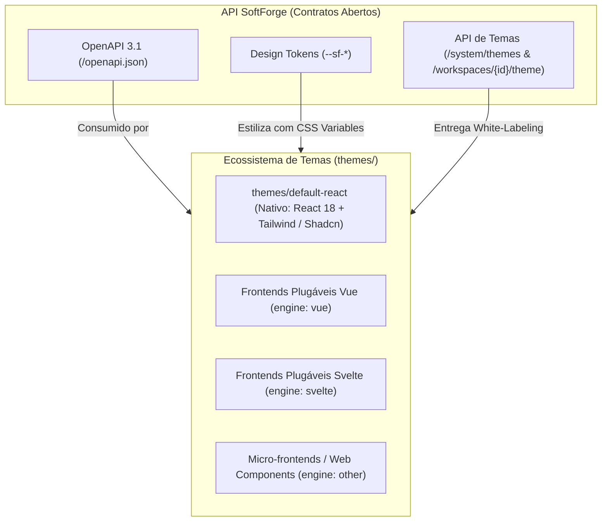

# Sistema de Temas & Multi-Frontends Agnósticos

> **Arquitetura aberta e desacoplada que disponibiliza o Tema Padrão nativo em React 18 / Tailwind e permite conectar qualquer interface moderna (Vue, Svelte, micro-frontends) sobre a mesma API e contratos abertos do SoftForge.**

---

## 1. Visão Geral da Arquitetura

O SoftForge não impõe vendor-lock de interface. Ele foi concebido para que clientes, desenvolvedores e **agentes autônomos de IA** possam utilizar a implementação oficial em React ou plugar qualquer biblioteca ou framework visual moderno:



### Princípios de Design
1. **Contratos OpenAPI 3.1 como Ponte:** Todo frontend (seja o tema oficial React ou um aplicativo externo em Vue/Svelte) consome os mesmos endpoints autenticados (JWT via cookies HttpOnly ou header `Authorization: Bearer`).
2. **Design Tokens Universais (`--sf-*`):** Cores, raios de borda e tipografia são expostos como variáveis CSS nativas que mapeiam naturalmente para Tailwind (`bg-primary`), CSS puro ou variáveis de design systems modernos.
3. **Manifesto Declarativo (`softforge-theme.json`):** Arquivo padronizado que descreve o motor (`engine`), metadados e tokens do tema.
4. **White-Labeling por Workspace:** Cada cliente pode ter sua identidade visual (logo, cor primária e CSS customizado) aplicada em tempo real.

---

## 2. O Manifesto do Tema (`softforge-theme.json`)

Todo tema localizado no diretório raiz `themes/{nome-do-tema}/` contém um manifesto declarativo validado pelo esquema `theme-schema.json`:

```json
{
  "$schema": "../theme-schema.json",
  "name": "SoftForge Default React",
  "slug": "default-react",
  "version": "1.0.0",
  "engine": "react",
  "author": "SoftForge Core Team",
  "description": "Tema padrão oficial em React 18, Vite, Tailwind CSS e componentes acessíveis Shadcn/UI.",
  "tokens": {
    "colors": {
      "primary": "#2563eb",
      "primary_foreground": "#f8fafc",
      "background": "#ffffff",
      "foreground": "#0f172a",
      "card": "#ffffff",
      "card_foreground": "#0f172a",
      "border": "#e2e8f0",
      "muted": "#f1f5f9",
      "muted_foreground": "#64748b",
      "accent": "#f1f5f9"
    },
    "typography": {
      "font_family": "Inter, system-ui, -apple-system, sans-serif",
      "font_size_base": "16px",
      "line_height": "1.5"
    },
    "geometry": {
      "border_radius": "0.5rem"
    }
  },
  "assets": {
    "stylesheets": [
      "/src/index.css"
    ],
    "scripts": [
      "/src/main.tsx"
    ]
  }
}
```

---

## 3. Mapeamento de Design Tokens Universais

O SoftForge injeta os tokens no elemento raiz (`:root`) do HTML, permitindo reutilização imediata:

| Token Universal | CSS Variable | Mapeamento Tailwind | Aplicação CSS Nativo |
| :--- | :--- | :--- | :--- |
| Cor Primária | `--sf-color-primary` | `bg-primary` / `text-primary` | `var(--sf-color-primary)` |
| Fundo Geral | `--sf-color-bg` | `bg-background` | `var(--sf-color-bg)` |
| Cor do Texto | `--sf-color-text` | `text-foreground` | `var(--sf-color-text)` |
| Superfície / Card | `--sf-color-card` | `bg-card` | `var(--sf-color-card)` |
| Borda | `--sf-color-border` | `border-border` | `var(--sf-color-border)` |
| Raio de Borda | `--sf-radius` | `rounded-lg` | `var(--sf-radius)` |
| Fonte Principal | `--sf-font-family` | `font-sans` | `var(--sf-font-family)` |

---

## 4. Como Conectar um Novo Frontend ou Tema

A arquitetura Multi-Frontend do SoftForge permite que novas interfaces se integrem sem alterações no núcleo da API:

1. **Crie a pasta do tema em `themes/<nome-do-tema>/`**.
2. **Adicione o arquivo `softforge-theme.json`** especificando o motor (`"react"`, `"vue"`, `"svelte"` ou `"other"`):
   ```json
   {
     "$schema": "../theme-schema.json",
     "name": "Meu Tema Vue 3",
     "slug": "meu-tema-vue",
     "version": "1.0.0",
     "engine": "vue",
     "tokens": {
       "colors": {
         "primary": "#42b883"
       }
     }
   }
   ```
3. **Consuma os endpoints da API SoftForge:**
   - Obtenha os tokens do tenant via `GET /api/v1/workspaces/{id}/theme`.
   - Aplique o mapa `css_variables` retornado diretamente no cabeçalho ou elemento `:root` do frontend.
   - Utilize as rotas padronizadas OpenAPI para gerenciar recursos (`/api/v1/projects`, `/api/v1/auth`, etc.).

---

## 5. Endpoints de White-Labeling e Temas no Backend

| Método | Endpoint | Papel Mínimo | Descrição |
| :--- | :--- | :--- | :--- |
| `GET` | `/api/v1/system/themes` | Público / Autenticado | Lista todos os temas e engines instalados no diretório `themes/`. |
| `GET` | `/api/v1/system/themes/{slug}` | Público / Autenticado | Retorna o manifesto completo e tokens do tema indicado pelo slug. |
| `GET` | `/api/v1/workspaces/{id}/theme` | Viewer | Retorna as variáveis de tema e branding consolidadas do workspace. |
| `PATCH`| `/api/v1/workspaces/{id}/theme` | Admin | Altera logo customizada, cor primária, tema ativo ou CSS customizado. |
