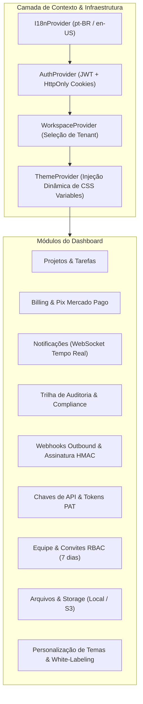

# Interface Visual & Dashboard Unificado do Frontend

> **Painel administrativo modular construído em React 18, Vite e Tailwind CSS, integrando 100% das fatias verticais do SoftForge em uma experiência visual de alta produtividade.**

---

## 1. Visão Geral da Arquitetura Visual

O frontend do SoftForge (`apps/web`) opera como uma Single Page Application (SPA) desacoplada, orientada a fatias de recursos e alimentada por contratos OpenAPI 3.1:



---

## 2. Injeção Dinâmica de Design Tokens (`ThemeProvider`)

O `ThemeProvider` em `apps/web/src/core/theme/` sincroniza dinamicamente as variáveis de design no DOM:

1. **Leitura da API de Temas:** Ao alternar de workspace, consulta `GET /api/v1/workspaces/{id}/theme`.
2. **Injeção de `--sf-*`:** Aplica variáveis canônicas (`--sf-color-primary`, `--sf-color-bg`, `--sf-radius`) no elemento `:root`.
3. **Mapeamento HSL para Tailwind:** Converte cores hexadecimais para HSL (`H S% L%`) e atualiza a variável nativa `--primary` do Tailwind CSS, garantindo que botões, badges e bordas adotem a cor corporativa do tenant instantaneamente.
4. **CSS Customizado:** Injeta ou remove elementos `<style id="sf-workspace-custom-css">` para clientes Enterprise.

---

## 3. Módulos Funcionais do Dashboard

| Módulo | Componente | Descrição da Experiência Visual |
| :--- | :--- | :--- |
| **Projetos** | `ProjectsView` | Criação de projetos de software ou metas de IA, listagem em cards, expansão de tarefas rápidas e status. |
| **Billing & Pix** | `BillingView` | Comparativo de planos (Free, Pro, Enterprise), status da assinatura e modal de checkout Pix com QR Code e Copia-e-Cola. |
| **Notificações** | `NotificationsView` / `NotificationBell` | Conexão WebSocket viva com ping/pong, sino com contador badge no topo e histórico de alertas com marcação como lida. |
| **Auditoria** | `AuditView` | Tabela filtrável de eventos de auditoria com busca textual por ação, usuário, IP de origem e data. |
| **Webhooks** | `WebhooksView` | Cadastro de endpoints de destino, visualização mascarada do segredo HMAC e histórico de entregas. |
| **Chaves de API** | `ApiKeysView` | Criação de chaves PAT com aviso único de revelação do segredo criptográfico e revogação instantânea. |
| **Equipe & RBAC** | `MembersView` | Listagem de colaboradores com cargos (Owner, Admin, Member, Viewer) e formulário de convites assinados com expiração. |
| **Storage & Arquivos**| `StorageView` | Upload de arquivos com formatação de tamanho (KB/MB), tipo MIME com ícones temáticos e links para download. |
| **Temas & White-label**| `ThemesView` | Catálogo de temas instalados, paleta de cores primárias com preview ao vivo, logo customizado e editor CSS. |

---

## 4. Comunicação em Tempo Real via WebSocket

O sino de notificações (`NotificationBell`) estabelece canal bidirecional persistente:

```typescript
const wsUrl = `${protocol}//${host}/api/v1/notifications/ws?token=${token}`;
const ws = new WebSocket(wsUrl);

ws.onmessage = (event) => {
  const data = JSON.parse(event.data);
  if (data.type === "pong") return;
  // Notificação recebida em tempo real
  setUnreadCount((prev) => prev + 1);
};
```
