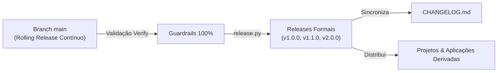

# Política de Versionamento & Releases

> **Governança SemVer, Ciclo de Vida e Lançamentos no SoftForge**  
> *Semantic Versioning 2.0.0 • Rolling Main • Monorepo Unificado • CHANGELOG Contínuo*

---

## 1. Visão Geral e Filosofia

O **SoftForge** foi concebido para ser utilizado tanto por desenvolvedores humanos quanto por **Agentes Autônomos de IA** que geram produtos de produção. 

Para equilibrar inovação contínua e máxima previsibilidade operacional, adotamos o modelo **SemVer Híbrido**:



1. **Branch `main` (Rolling Release Contínuo):**  
   O branch principal está sempre em estado deployável e pronto para uso imediato. Nenhum código quebra os guardrails de tipos, lint ou testes em `main`.
2. **Releases Formais SemVer (`vX.Y.Z`):**  
   Marcos oficiais congelados no tempo através de tags Git assinadas, acompanhados de notas detalhadas no `CHANGELOG.md` e releases no GitHub.
3. **Versão Única Global (Monorepo):**  
   A API (`apps/api`), o Frontend (`apps/web`), o catálogo de Temas (`themes/`), as Skills de IA e a documentação avançam sempre sob o mesmo número de versão.

---

## 2. Estrutura SemVer 2.0.0 (`MAJOR.MINOR.PATCH`)

```text
       v 1 . 2 . 4
         │   │   │
         │   │   └── PATCH: Correções de bugs, segurança e docs (sem alterar APIs)
         │   └────── MINOR: Novas fatias verticais, novos temas, rotas retrocompatíveis
         └────────── MAJOR: Quebras de contrato, remoção de rotas, migrações destrutivas
```

### 1. MAJOR (`vX.0.0`)
- **Quando ocorre:** Qualquer modificação que quebre compatibilidade com contratos anteriores.
- **Exemplos no SoftForge:**
  - Remoção ou alteração drástica de campos em schemas OpenAPI sem retrocompatibilidade.
  - Modificações destrutivas no banco de dados (exclusão ou renomeação de colunas/tabelas).
  - Alterações incompatíveis na especificação `softforge-theme.json` ou nos tokens CSS universais (`--sf-*`).
- **Política de Transição:** As mudanças são lançadas diretamente no MAJOR, exigindo:
  1. Migração Alembic reversível.
  2. Guia de migração passo a passo no `CHANGELOG.md`.

### 2. MINOR (`v1.X.0`)
- **Quando ocorre:** Novos recursos e fatias verticais adicionados de forma 100% retrocompatível.
- **Exemplos no SoftForge:**
  - Adição de uma nova fatia vertical em `apps/api/src/slices/` (ex: `crm`, `billing`, `storage`).
  - Novos endpoints HTTP ou novos campos opcionais em schemas existentes.
  - Migrações de banco aditivas (novas tabelas ou novas colunas com valores padrão).
  - Novos temas disponibilizados no catálogo `themes/`.
  - Novas skills ou regras no diretório `.agents/skills/`.

### 3. PATCH (`v1.0.X`)
- **Quando ocorre:** Correções de bugs, segurança, documentação ou melhorias internas de performance.
- **Exemplos no SoftForge:**
  - Correção de falha de validação ou cálculo em `service.py`.
  - Ajuste de responsividade ou visual em componentes do `apps/web`.
  - Atualização de dependências com vulnerabilidades (CVEs).
  - Correção de links e formatação em `docs/`.

---

## 3. Automação de Releases com `release.py`

O SoftForge conta com um utilitário CLI exclusivo para orquestrar lançamentos com total garantia de integridade:

```bash
# Executa a suíte de guardrails, atualiza arquivos e gera commit/tag Git:
python tools/scripts/release.py --bump minor --tag -m "Adiciona fatia de convites de equipe"

# Ou especifique uma versão explícita:
python tools/scripts/release.py --version 1.0.0 --tag -m "Lançamento oficial GA"
```

### O que o `release.py` executa em sequência:
1. **Validação de Guardrails:** Executa `python tools/scripts/verify.py`. Se qualquer teste, contrato ou linter falhar, o processo é abortado imediatamente.
2. **Sincronização de Versões:** Atualiza `apps/api/pyproject.toml`, `apps/web/package.json` e `docs/package.json`.
3. **Geração do Changelog:** Analisa os commits Git recentes (Conventional Commits) e adiciona a nova seção no topo do `CHANGELOG.md`.
4. **Git Commit e Tag:** Realiza o commit com mensagem `chore(release): release vX.Y.Z` e cria a tag anotada `vX.Y.Z`.

---

## 4. Como Manter Seu Projeto Atualizado com o SoftForge

Para aplicações desenvolvidas com o SoftForge que desejam receber melhorias do framework upstream:

```bash
# Adicionar o repositório oficial como upstream (caso tenha feito fork):
git remote add upstream https://github.com/omauriciofala/softforge.redepronta.com.git

# Buscar novas releases e tags:
git fetch upstream --tags

# Atualizar fatias ou o core para a última versão estável:
git merge v1.1.0
```

Se houver novas migrações de banco de dados, execute o validador:
```bash
python tools/scripts/migrate.py upgrade
python tools/scripts/verify.py
```
