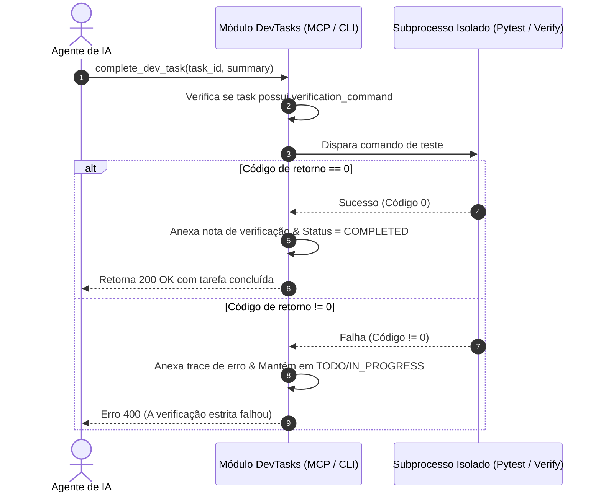

# 22. Fatia: Gestor de Tarefas de Desenvolvimento & Servidor MCP para IA

> **Módulo Nativo:** `apps/api/src/slices/dev_tasks/`  
> **Comando de Atalho:** `python tools/scripts/dev_tasks.py`  
> **Protocolo MCP:** JSON-RPC 2.0 nativo sobre `stdio` (zero dependências externas)  
> **Filosofia:** Andrej Karpathy Principle 4 (*Goal-Driven Execution & Automated Verification*)

---

## 1. Visão Geral

A fatia **DevTasks** (`dev_tasks`) foi projetada como um módulo independente no SoftForge que permite que tanto desenvolvedores humanos quanto **Agentes Autônomos de IA** (Google Antigravity, Claude Code, Cursor, Windsurf) gerenciem e executem o ciclo completo de tarefas técnicas.

Diferente de listas de afazeres genéricas, as tarefas de desenvolvimento contêm:
- **Arquivos-alvo (`target_files`):** Delimitação cirúrgica de quais partes da base serão tocadas.
- **Critérios de aceite (`acceptance_criteria`):** Regras estritas de validação.
- **Comando de verificação (`verification_command`):** Guardrail executável (ex: `pytest ...` ou `python tools/scripts/verify.py`).
- **Histórico de notas técnicas (`notes`):** Registro de progresso, decisões de design e eventuais bloqueios.

---

## 2. Acesso Direto ao Banco (Zero Dependência de Uvicorn)

Uma das maiores vantagens para agentes de IA é que tanto o **CLI** quanto o **Servidor MCP** acessam o banco de dados diretamente via SQLAlchemy assíncrono.
- O desenvolvedor ou agente **não precisa** manter o servidor FastAPI ativo na porta 8000 para consultar ou avançar tarefas.
- As tabelas e workspaces locais são inicializados sob demanda transparentemente.

---

## 3. O Guardrail de Verificação Estrita

Seguindo o princípio inegociável do SoftForge (*"NUNCA declare vitória sem a aprovação de 100% dos testes"*):



---

## 4. Uso via Terminal (CLI)

```bash
# Listar tarefas pendentes
python tools/scripts/dev_tasks.py list --status todo

# Criar nova tarefa
python tools/scripts/dev_tasks.py create \
  --title "Implementar autenticação WebAuthn" \
  --desc "Adicionar suporte a passkeys" \
  --target-files "apps/api/src/slices/auth/passkeys.py" \
  --criteria "Passar no teste unitário,Validar contrato OpenAPI" \
  --verify-cmd "pytest apps/api/src/slices/auth/tests/test_passkeys.py"

# Assumir tarefa por um agente
python tools/scripts/dev_tasks.py claim <TASK_ID> --agent "antigravity"

# Anotar progresso
python tools/scripts/dev_tasks.py note <TASK_ID> --content "Esqueleto de rotas pronto."

# Concluir tarefa (roda a verificação estrita automaticamente)
python tools/scripts/dev_tasks.py complete <TASK_ID> --summary "Passkeys implementadas e verificadas."

# Reportar impedimento (bloqueio)
python tools/scripts/dev_tasks.py fail <TASK_ID> --reason "Dependência externa indisponível" --blocked
```

---

## 5. Integração com Model Context Protocol (MCP)

Para integrar a assistentes como Google Antigravity, Claude Code ou Cursor, adicione a configuração MCP:

```json
{
  "mcpServers": {
    "softforge-dev-tasks": {
      "command": "python",
      "args": ["tools/scripts/dev_tasks.py", "mcp"]
    }
  }
}
```

O servidor expõe nativamente as ferramentas:
- `list_dev_tasks`
- `get_dev_task`
- `create_dev_task`
- `claim_dev_task`
- `log_dev_task_progress`
- `complete_dev_task`
- `fail_dev_task`
