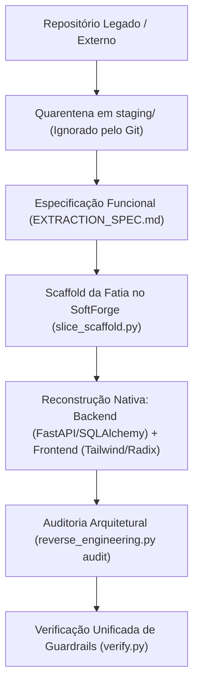

# Engenharia Reversa e Migração Segura de Legados

O SoftForge foi concebido para ser operado com extrema fluidez por desenvolvedores humanos e agentes autônomos de IA. Uma das tarefas mais frequentes na modernização de software é **incorporar funcionalidades de outros sistemas, repositórios existentes ou softwares legados**.

Para realizar esse processo sem degradar a base de código, o SoftForge estabelece a **Área de Quarentena (`staging/`)** e o princípio da **Extração Pura de Funcionalidade**.

---

## 1. Princípios Fundamentais



### 1.1 Quarentena Inegociável (Zero Lixo)
- Nenhum arquivo de projeto externo ou legado deve ser clonado ou inserido diretamente em `apps/api/`, `apps/web/` ou `tools/`.
- Todos os repositórios legados residem na pasta `staging/<nome_do_sistema>/`.
- O arquivo `.gitignore` do SoftForge ignora `staging/*` automaticamente. Dependências externas como `node_modules/`, `venv/`, dumps de banco ou credenciais antigas **nunca** serão commitadas.

### 1.2 Extração Pura de Funcionalidade (Zero Distorção de Stack)
- Não portamos nem "traduzimos" código legado linha por linha.
- Extraímos **apenas as capacidades de negócio**:
  - Modelos conceituais e campos de dados -> Convertidos para SQLAlchemy 2.0 (`src.core.database.Base`).
  - Endpoints e contratos -> Convertidos para FastAPI e Pydantic v2.
  - Regras de cálculo, validações e fluxos -> Convertidos para funções assíncronas em `service.py`.
- **NUNCA** são instaladas bibliotecas do backend antigo (Django ORM, Express, TypeORM, Prisma, etc.).

### 1.3 Preservação Absoluta do Design System (Zero Distorção de UI)
- **Proibição Rígida:** NUNCA copie folhas de estilo legadas (`.css`, `.scss`, `.less`), classes de frameworks antigos (Bootstrap, Ant Design, Material-UI, Bulma) ou scripts jQuery.
- Toda a interface no SoftForge é construída do zero em `apps/web/src/features/<fatia>/` utilizando:
  - Componentes oficiais em `apps/web/src/components/ui/` (Radix UI / Shadcn).
  - Classes utilitárias do Tailwind CSS v3 e tokens semânticos do tema ativo.
  - Ícones do pacote `lucide-react`.
  - Cliente de requisições padronizado (`@/lib/api-client`).

---

## 2. Ferramental Nativo (`tools/scripts/reverse_engineering.py`)

O SoftForge fornece um assistente CLI para guiar o ciclo de engenharia reversa com segurança:

### 2.1 Inicializar uma Área de Quarentena
Para criar o ambiente isolado e a especificação de extração de um novo sistema:
```bash
python tools/scripts/reverse_engineering.py init --name crm-antigo
```
O comando criará:
```text
staging/crm-antigo/
├── .gitignore             # Proteção em profundidade
├── EXTRACTION_SPEC.md     # Roteiro de mapeamento de entidades e regras
└── source/                # Pasta onde você coloca o código original
```

### 2.2 Listar Projetos em Quarentena
```bash
python tools/scripts/reverse_engineering.py list
```

### 2.3 Auditar Conformidade da Fatia Migrada
Após implementar a fatia vertical, valide se todas as diretrizes do SoftForge foram respeitadas e se nenhuma biblioteca estranha foi importada:
```bash
python tools/scripts/reverse_engineering.py audit --slice <nome_da_fatia>
```

---

## 3. Workflow de Execução Passo a Passo

1. **Inicialização:**
   Execute `python tools/scripts/reverse_engineering.py init --name <sistema>`.
2. **Carga do Legado:**
   Copie os arquivos ou clone o repositório na pasta `staging/<sistema>/source/`.
3. **Mapeamento:**
   Edite `staging/<sistema>/EXTRACTION_SPEC.md` preenchendo as tabelas de De-Para (Entidades, Endpoints, Regras e Telas).
4. **Scaffold da Fatia:**
   Crie a estrutura da fatia vertical:
   ```bash
   python tools/scripts/slice_scaffold.py --name <nome_da_fatia>
   ```
5. **Implementação do Backend:**
   - Preencha `models.py` com campos tipados, herança de `Base` e `workspace_id`.
   - Configure os contratos em `schemas.py` com Pydantic v2.
   - Implemente as funções em `service.py` com `AsyncSession`.
   - Proteja as rotas em `router.py` usando `require_workspace_role(...)`.
   - Ajuste os testes de ciclo de vida em `tests/test_<nome_da_fatia>_slice.py`.
6. **Implementação da UI Frontend:**
   - Crie a pasta da feature em `apps/web/src/features/<nome_da_fatia>/`.
   - Monte as interfaces usando os componentes do SoftForge (`Card`, `Button`, `Table`, etc.).
7. **Auditoria e Verificação:**
   ```bash
   python tools/scripts/reverse_engineering.py audit --slice <nome_da_fatia>
   python tools/scripts/export_openapi.py
   python tools/scripts/verify.py
   ```
8. **Finalização:**
   A pasta em `staging/<sistema>/` pode ser descartada ou mantida localmente para referência, garantindo zero impacto no versionamento Git e no build de produção.
